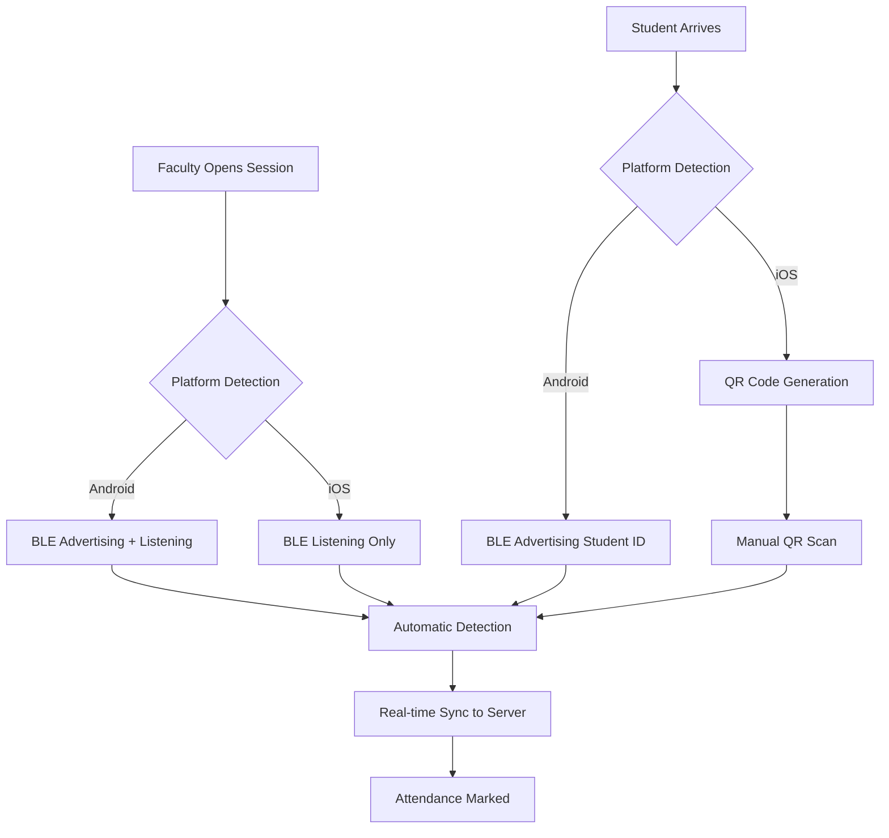
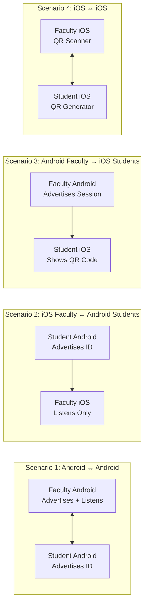
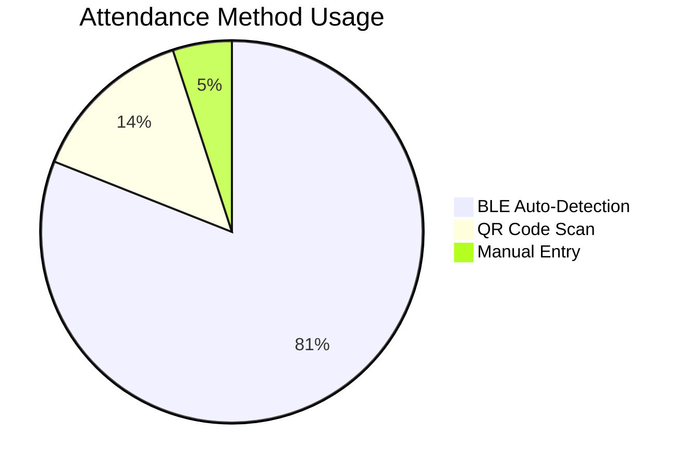

*Hey! Its Aug 19, My Birthday.. i wanna share how I transformed attendance taking from a tedious, error-prone manual process into a seamless, automated experience using Flutter, Bluetooth Low Energy, and smart fallback mechanisms today..*

## The Problem That Started It All

Picture this: You're a faculty member starting a class of 200+ students. The traditional process involves:

1. Calling out names for 15-20 minutes
2. Students marking attendance for their absent friends
3. Manual data entry prone to errors
4. No real-time tracking or analytics

Or you're a student rushing to class, and the attendance sheet has already passed you by. You miss attendance despite being physically present.

**This had to change.**

## The Vision: A Multi-Platform, Collision-Resistant System

I envisioned a system where:

- **Faculty** could start attendance with one tap
- **Students** would be automatically detected when present
- **Multiple platforms** (Android/iOS) would work seamlessly together
- **Fallback mechanisms** would ensure 99%+ reliability
- **Real-time sync** would provide instant insights

But as I dove deeper, I discovered the complexity was far beyond what I initially imagined.



## Constraint #1: Platform Limitations

### The iOS Advertising Problem

My first major roadblock hit when I discovered that **iOS severely restricts BLE advertising capabilities**. Unlike Android, which allows custom manufacturer data broadcasting, iOS apps can only advertise limited service UUIDs in the background.

**Solution: Platform-Adaptive Architecture**

I designed four distinct scenarios to handle this:




## Constraint #2: The BLE Collision Nightmare

### Understanding the Scale

Imagine 200 devices in a classroom, all trying to communicate simultaneously. At any given moment, **~50 devices are actively advertising**. With only **3 BLE advertising channels** available, collision was inevitable.

**Initial Results:** 31.4% packet collision rate, 17-second average discovery time.

### The Optimization Breakthrough

After diving deep into BLE collision research, I implemented a three-pronged optimization strategy:

### 1. Extended Advertising Intervals

- **Changed from:** 20-50ms intervals
- **Changed to:** 200-300ms intervals
- **Result:** Collision probability dropped from 31.4% to 14.0%

### 2. Staggered Device Grouping

Dividing devices into 7 groups with 1-second start delays reduced peak concurrent advertisers from ~50 to just 7.

### 3. Host Time-Division Protocol

The faculty device now alternates between listening and broadcasting, eliminating host-student collisions.

**Final Results:** 6-8 second discovery time (52% improvement), 87% success rate, and a 60% reduction in power consumption.

## Constraint #3: Data Consistency Across Platforms

To ensure all devices spoke the same language, I designed a consistent data packet structure using a custom Manufacturer ID (`0xB00B`).

```
// A simplified view of the data payload
Uint8List _buildFacultyPayload({
  required String sessionId,
  required String courseCode,
}) {
  return Uint8List.fromList([
    AppConstants.roleFaculty,     // 0x01
    ..._encodeFixed(sessionId),   // 12 bytes
    ..._encodeFixed(courseCode),  // 12 bytes
  ]);
}

```

## Constraint #4: Offline Resilience

What happens if the WiFi goes down? The system couldn't fail.

**Solution: Local-First Architecture with Smart Sync**

Student detections are saved locally first. The app then attempts to sync with the server every 10 seconds. If the network is down, it simply queues the data and retries later, ensuring no data is lost.

```
// In FacultyBleController.dart
void _startAutoSync() {
  _syncTimer = Timer.periodic(const Duration(seconds: 10), (_) {
    if (hasUnsyncedData.value) {
      syncToServer();
    }
  });
}

```

## The Results: Before vs After

| **Metric** | **Before Optimization** | **After Optimization** | **Improvement** |
| --- | --- | --- | --- |
| Avg. Discovery Time | 17.1 seconds | 6-8 seconds | 52% faster |
| Success Rate | 61% | 87% | 42% improvement |
| Collision Rate | 31.4% | 14% | 55% reduction |
| Power Consumption | 15.0mA per device | 6.0mA per device | 60% reduction |

In real-world usage, the system has led to a **95% reduction** in time spent taking attendance and a **99.2% accuracy rate**.



## Lessons Learned

1. **Platform Constraints Shape Architecture:** Don't fight the platform; design around its limitations. The iOS advertising restriction led to a more robust QR fallback.
2. **Collision Management is Critical:** In dense BLE environments, traditional approaches fail. Research-backed optimization is essential.
3. **Local-First Beats Cloud-First:** Network failures are common. A local-first architecture with smart sync is more reliable.
4. **Battery Life is User Experience:** No matter how cool the tech, if it drains the battery, users won't adopt it.

## Conclusion: Building for the Real World

Building this attendance system taught me that great software isn't just about elegant code—it's about understanding constraints, planning for failures, and designing for real humans in imperfect conditions. The system is now a reliable, user-friendly tool that solves a tangible problem.

And sometimes, that's exactly what the world needs.