Welcome back to the roadmap again.

In our [last post](https://blog.satyendra.in/devops-cloud-engineering-roadmap-and-handbook), we mapped out the grand journey of becoming a Cloud Engineer. We talked about Linux, Networking, and dipped our toes into the container waters.

Today, we are diving into the deep end.

Docker is deceptively simple. You type `docker run`, magic happens, and you feel like a wizard. But there is a massive difference between "I got the container running" and "This container is production-ready, secure, and won't eat my cloud bill for breakfast."

## The "Docker Run" Rabbit Hole

We have all been there. You start with a simple need: run a database.

**You:** `docker run postgres`**Docker:** *Runs.***You:** "Wait, I need a password."
**You:** `docker run -e POSTGRES_PASSWORD=secret postgres`**You:** "I need it to persist data."
**You:** `docker run -e POSTGRES_PASSWORD=secret -v ./data:/var/lib/postgresql/data postgres`**You:** "I need it on a specific network, exposed on port 5432, and named 'my-db'..."

Suddenly, your terminal looks like this:

```bash
docker run -d \\
  --name my-db \\
  -e POSTGRES_PASSWORD=secret \\
  -v $(pwd)/data:/var/lib/postgresql/data \\
  -p 5432:5432 \\
  --network my-app-net \\
  --restart always \\
  postgres:14-alpine

```

If you are pasting this into a sticky note on your desktop, stop. You have entered the "Docker Run Rabbit Hole."

```mermaid
graph TD
    A[Simple Requirement] --> B{Add a flag?};
    B -- Yes --> C[Command gets longer];
    C --> B;
    B -- No --> D[Command is now 4 lines long];
    D --> E[Copy-Paste errors];
    E --> F[Production Outage 🔥];

```



The solution? **Infrastructure as Code.** In Docker land, that starts with mastering the **Dockerfile**.

We are going to move from being **Container Cowboys** (yee-haw, `sudo docker run --privileged`!) to **Docker Craftsmen**.

Grab your coffee. Let’s optimize some layers.

# 

**From Installation to Production-Ready Deployments**

This guide provides an in-depth, technically rigorous exploration of Docker best practices for developers with solid technical backgrounds. It covers everything from installation on Ubuntu 24.04 LTS through production deployment strategies on cloud platforms, Kubernetes, and bare metal servers. This guide assumes zero prior Docker knowledge while building expertise to production-level mastery.

## 1. Introduction

Docker is a containerization platform that packages applications with their dependencies into isolated, portable containers. Unlike virtual machines that virtualize hardware, containers virtualize the operating system, sharing the host kernel while maintaining process isolation. This makes containers lightweight, fast to start, and resource-efficient.

**Why Docker matters for production deployments:**

- **Consistency**: The same container runs identically across development, staging, and production environments, eliminating "works on my machine" issues.
- **Isolation**: Applications run in isolated environments with defined resource limits and security boundaries.
- **Efficiency**: Containers start in milliseconds and use fewer resources than VMs because they share the host OS kernel.
- **Scalability**: Container orchestration platforms can scale applications horizontally with ease.
- **DevOps Integration**: Docker integrates seamlessly with CI/CD pipelines for automated testing and deployment.

**Container vs Virtual Machine**: A virtual machine includes a full operating system with its own kernel, while a container shares the host's kernel and only packages the application and its dependencies. This architectural difference means containers are 10-100x smaller and start 10-100x faster than VMs.


## 2. Installation

### 2.1 Installing Docker Engine on Ubuntu 24.04 LTS

Docker Engine is the core runtime that builds and runs containers. On Ubuntu 24.04, you'll install Docker from the official Docker repository to ensure you get the latest stable version.

**Prerequisites verification:**

Before installing Docker, verify your system meets the requirements:

```bash
# Check Ubuntu version
lsb_release -a
# Output should show: Ubuntu 24.04 LTS (Noble)

# Verify 64-bit system
uname -m
# Output should show: x86_64 or aarch64

# Check kernel version (should be 3.10+, Ubuntu 24.04 has 6.x)
uname -r

```

**Understanding technical terms:**

- **Kernel**: The core of the operating system that manages hardware and system resources
- **64-bit system**: Computer architecture that can address more than 4GB of RAM and process data in 64-bit chunks
- **Repository**: A storage location from which software packages are retrieved and installed

**Step 1: Update system packages**

Update your package index to ensure you're installing the latest versions:

```bash
sudo apt update
sudo apt upgrade -y

```

**What this does**: `apt update` refreshes the list of available packages from configured repositories, while `apt upgrade` installs newer versions of installed packages.

**Step 2: Install required dependencies**

Install prerequisite packages that Docker needs:

```bash
sudo apt install -y \\
    apt-transport-https \\
    ca-certificates \\
    curl \\
    software-properties-common \\
    lsb-release

```

**What each package does:**

- `apt-transport-https`: Allows apt to retrieve packages over HTTPS (secure HTTP)
- `ca-certificates`: Contains trusted Certificate Authority certificates for verifying SSL connections
- `curl`: Command-line tool for transferring data using URLs
- `software-properties-common`: Provides scripts for managing software repositories
- `lsb-release`: Provides Linux Standard Base information about your distribution

**Step 3: Add Docker's GPG key**

Add Docker's official GPG key to verify package authenticity:

```bash
sudo mkdir -p /etc/apt/keyrings
curl -fsSL <https://download.docker.com/linux/ubuntu/gpg> | \\
    sudo gpg --dearmor -o /etc/apt/keyrings/docker.gpg
sudo chmod a+r /etc/apt/keyrings/docker.gpg

```

**Technical explanation:**

- **GPG (GNU Privacy Guard)**: Encryption software used to verify that packages haven't been tampered with
- **Dearmor**: Converts ASCII-armored GPG key to binary format that apt can use
- `chmod a+r`: Makes the key file readable by all users (required for apt to access it)

**Step 4: Add Docker repository**

For Ubuntu 24.04 (codename "noble"), Docker packages are available. Add the repository:

```bash
echo \\
  "deb [arch=$(dpkg --print-architecture) signed-by=/etc/apt/keyrings/docker.gpg] \\
  <https://download.docker.com/linux/ubuntu> \\
  $(lsb_release -cs) stable" | \\
  sudo tee /etc/apt/sources.list.d/docker.list > /dev/null

```

**What this command does:**

- `dpkg --print-architecture`: Detects your CPU architecture (amd64, arm64, etc.)
- `lsb_release -cs`: Gets your Ubuntu codename (noble for 24.04)
- `tee`: Writes the repository configuration to a file while showing no output (`> /dev/null`)

**Note**: If Docker doesn't yet support the "noble" codename, use "jammy" (Ubuntu 22.04) as a workaround:

```bash
echo \\
  "deb [arch=$(dpkg --print-architecture) signed-by=/etc/apt/keyrings/docker.gpg] \\
  <https://download.docker.com/linux/ubuntu> \\
  jammy stable" | \\
  sudo tee /etc/apt/sources.list.d/docker.list > /dev/null

```

**Step 5: Install Docker Engine**

Install Docker Engine, CLI, and required plugins:

```bash
sudo apt update
sudo apt install -y \\
    docker-ce \\
    docker-ce-cli \\
    containerd.io \\
    docker-buildx-plugin \\
    docker-compose-plugin

```

**Package breakdown:**

- **docker-ce**: Docker Community Edition engine (the core daemon that runs containers)
- **docker-ce-cli**: Command-line interface for interacting with Docker
- [**containerd.io**](http://containerd.io/): Container runtime that manages the complete container lifecycle
- **docker-buildx-plugin**: Extended build capabilities with BuildKit for advanced features
- **docker-compose-plugin**: Tool for defining and running multi-container applications

**Technical terms:**

- **Daemon**: A background process that runs continuously and handles requests
- **Runtime**: Software that executes and manages running containers
- **BuildKit**: Docker's next-generation build system with improved performance and caching

**Step 6: Enable and start Docker service**

Configure Docker to start automatically on boot:

```bash
sudo systemctl enable docker
sudo systemctl start docker
sudo systemctl status docker

```

**What these commands do:**

- `enable`: Creates symbolic links so Docker starts automatically at boot
- `start`: Starts the Docker daemon immediately
- `status`: Shows whether Docker is running and displays recent log entries

Press `Ctrl+C` to exit the status view.

### 2.2 Installing Docker Compose v2

Docker Compose is a tool for defining and running multi-container applications using YAML configuration files. Compose v2 was rewritten in Go and is now a Docker CLI plugin (accessed via `docker compose` rather than the old `docker-compose` command).

**Installation via apt (recommended)**

Docker Compose v2 is included when you install `docker-compose-plugin`:

```bash
# If not already installed in step 2.1
sudo apt install docker-compose-plugin

# Verify installation
docker compose version
# Output: Docker Compose version v2.40.2 (or later)

```

**Manual installation (if needed)**

To install a specific version or the latest release manually:

```bash
# Create plugin directory
mkdir -p ~/.docker/cli-plugins

# Download latest release (check GitHub for current version)
COMPOSE_VERSION="v2.40.2"
curl -SL <https://github.com/docker/compose/releases/download/${COMPOSE_VERSION}/docker-compose-linux-x86_64> \\
    -o ~/.docker/cli-plugins/docker-compose

# Make executable
chmod +x ~/.docker/cli-plugins/docker-compose

# Verify
docker compose version

```

**System-wide installation** (for all users):

```bash
sudo curl -SL <https://github.com/docker/compose/releases/download/v2.40.2/docker-compose-linux-x86_64> \\
    -o /usr/local/lib/docker/cli-plugins/docker-compose
sudo chmod +x /usr/local/lib/docker/cli-plugins/docker-compose

```

**Technical note**: Compose v2 uses a space (`docker compose`) instead of a hyphen (`docker-compose`). The old syntax is deprecated but still works if you install the legacy version.

### 2.3 Verifying Installation

Verify Docker is working correctly:

```bash
# Check Docker version
docker --version
# Output: Docker version 29.0.4, build abc1234

# Check Docker Compose version
docker compose version
# Output: Docker Compose version v2.40.2

# Run test container
sudo docker run hello-world

```

**What the test container does:**

1. Docker searches for the `hello-world` image locally
2. Since it's not found, Docker pulls it from Docker Hub (the default registry)
3. Docker creates a container from the image
4. The container runs, prints a success message, and exits

**Expected output:**

```
Unable to find image 'hello-world:latest' locally
latest: Pulling from library/hello-world
...
Status: Downloaded newer image for hello-world:latest

Hello from Docker!
This message shows that your installation appears to be working correctly.
...

```

**Verify system information:**

```bash
sudo docker system info

```

This displays comprehensive information including:

- Server version
- Storage driver (typically `overlay2` on Ubuntu)
- Number of containers and images
- Docker root directory (`/var/lib/docker`)
- Logging driver (default is `json-file`)
- Operating system details
- CPU and memory information

### 2.4 Post-Installation Setup (Non-Root User)

By default, Docker requires `sudo` for all commands because the Docker daemon runs as root and owns the Unix socket `/var/run/docker.sock`. For convenience and security, add your user to the `docker` group.

**Add user to docker group:**

```bash
# Add current user to docker group
sudo usermod -aG docker $USER

# Verify group membership
groups $USER
# Output should include: ... docker ...

# Log out and log back in for changes to take effect
# Or use: newgrp docker

```

**Technical explanation:**

- **usermod**: Command to modify user account properties
- `aG`: Append to group (without removing from other groups)
- `$USER`: Environment variable containing your username
- **Unix socket**: Inter-process communication mechanism (file-based)

**Verify non-root access:**

```bash
# Should work without sudo
docker run hello-world
docker ps
docker images

```

**Security consideration**: Users in the `docker` group have effective root access to the host system because they can mount host directories and run privileged containers. Only add trusted users to this group.

## 3. Low-Level Docker Understanding

Understanding Docker CLI flags deeply is crucial for production deployments. This section explains important flags with practical examples and the reasoning behind their use.

### 3.1 Docker Run Flags

The `docker run` command creates and starts containers. Its general syntax is:

```bash
docker run [OPTIONS] IMAGE [COMMAND] [ARG...]

```

**Basic execution flags:**

- **`d, --detach`**: Run container in background (detached mode)

```bash
# Foreground (blocks terminal)
docker run nginx

# Background (returns container ID)
docker run -d nginx
# Output: a8f3d2c1e9b4... (container ID)

```

**When to use**: Production services, long-running processes, anything not requiring interactive terminal.

- **`it`**: Interactive terminal

```bash
# -i: Keep STDIN open (interactive)
# -t: Allocate pseudo-TTY (terminal)
docker run -it ubuntu bash

```

**When to use**: Debugging, running shell commands, development workflows.

**Technical explanation**:

- **STDIN**: Standard input stream (keyboard input)
- **TTY**: TeleTypewriter, a terminal interface that allows line editing and signal handling
- **Pseudo-TTY**: Software emulation of a terminal
- **`-rm`**: Automatically remove container when it exits

```bash
docker run --rm ubuntu echo "Hello"
# Container is deleted after printing

```

**When to use**: One-off tasks, CI/CD jobs, testing. Prevents accumulation of stopped containers.

- **`-name`**: Assign custom name to container

```bash
docker run --name my-web-server -d nginx

# Can now reference by name
docker stop my-web-server
docker logs my-web-server

```

**When to use**: Production deployments, containers you reference frequently. Without `--name`, Docker assigns random names like `zealous_darwin`.

**Environment and configuration flags:**

- **`e, --env`**: Set environment variables

```bash
# Single variable
docker run -e NODE_ENV=production node-app

# Multiple variables
docker run \\
    -e DATABASE_URL=postgres://db:5432/mydb \\
    -e REDIS_URL=redis://cache:6379 \\
    -e LOG_LEVEL=info \\
    my-app

```

- **`-env-file`**: Load variables from file

```bash
# .env file:
# DATABASE_URL=postgres://db:5432/mydb
# REDIS_URL=redis://cache:6379

docker run --env-file .env my-app

```

**Security warning**: Environment variables are visible in `docker inspect` and process listings. Never store secrets in environment variables in production. Use Docker secrets or external secret managers instead.

- **`w, --workdir`**: Set working directory inside container

```bash
docker run -w /app node:20 npm test
# Executes 'npm test' in /app directory

```

- **`-hostname`**: Set container hostname

```bash
docker run --hostname my-app-01 alpine hostname
# Output: my-app-01

```

- **`u, --user`**: Run as specific user

```bash
# Run as user ID 1000
docker run -u 1000 alpine id
# Output: uid=1000 gid=0(root)

# Run as user:group
docker run -u 1000:1000 alpine id
# Output: uid=1000 gid=1000

```

**When to use**: Security best practice. Never run production containers as root unless absolutely necessary.

**Resource flags (covered in detail in section 3.5):**

- **`-memory, -m`**: Memory limit

```bash
# Limit to 512MB
docker run -m 512m nginx

# With memory reservation (soft limit)
docker run -m 512m --memory-reservation 256m nginx

```

- **`-cpus`**: CPU limit

```bash
# Limit to 1.5 CPUs
docker run --cpus 1.5 nginx

# Allow 50% of one CPU
docker run --cpus 0.5 nginx

```

**Exit behavior flags:**

- **`-restart`**: Restart policy

```bash
# Never restart (default)
docker run --restart no nginx

# Always restart
docker run --restart always nginx

# Restart unless manually stopped
docker run --restart unless-stopped nginx

# Restart up to 3 times on failure
docker run --restart on-failure:3 nginx

```

**Policy explanations:**

- `no`: Never restart automatically
- `always`: Always restart, even after daemon restart
- `unless-stopped`: Restart unless manually stopped (recommended for production)
- `on-failure:N`: Restart only if container exits with non-zero code, max N times

**When to use**: Production deployments require restart policies to recover from crashes. Use `unless-stopped` for most services.

### 3.2 Docker Build Flags

The `docker build` command creates images from Dockerfiles.

**Basic build flags:**

- **`t, --tag`**: Name and tag image

```bash
# Tag format: name:tag
docker build -t myapp:1.0.0 .

# Multiple tags
docker build -t myapp:1.0.0 -t myapp:latest .

# With registry
docker build -t registry.example.com/myapp:1.0.0 .

```

**Tag naming convention**: `[registry/][namespace/]name[:tag][@digest]`

- **`f, --file`**: Specify Dockerfile location

```bash
# Use custom Dockerfile
docker build -f Dockerfile.prod -t myapp:prod .

# Dockerfile in subdirectory
docker build -f docker/Dockerfile.web -t web-app .

```

**`.` (build context)**: Directory containing files needed for build

```bash
# Current directory as context
docker build -t myapp .

# Different context directory
docker build -t myapp /path/to/project

```

**Technical explanation**: The build context is sent to the Docker daemon. All `COPY` and `ADD` commands in the Dockerfile are relative to this context. Large contexts slow builds.

**Build argument flags:**

- **`-build-arg`**: Pass build-time variables

```bash
# Define in Dockerfile: ARG VERSION=1.0
docker build --build-arg VERSION=2.0 -t myapp .

# Multiple arguments
docker build \\
    --build-arg NODE_VERSION=20 \\
    --build-arg BUILD_DATE=$(date -u +"%Y-%m-%dT%H:%M:%SZ") \\
    -t myapp .

```

- **`-target`**: Build specific stage in multi-stage Dockerfile

```bash
# Dockerfile with multiple stages:
# FROM node:20 AS build
# FROM node:20-alpine AS production

# Build only 'build' stage
docker build --target build -t myapp:builder .

# Build production stage
docker build --target production -t myapp:prod .

```

**Cache management flags:**

- **`-no-cache`**: Build without using cache

```bash
docker build --no-cache -t myapp .

```

**When to use**: When cache is causing issues, testing clean builds, or deploying security updates that must propagate through all layers.

- **`-cache-from`**: Use external cache source

```bash
# Pull and use image as cache
docker build \\
    --cache-from myapp:latest \\
    -t myapp:new .

```

**BuildKit cache flags** (requires `DOCKER_BUILDKIT=1`):

```bash
# Export inline cache
export DOCKER_BUILDKIT=1
docker build \\
    --build-arg BUILDKIT_INLINE_CACHE=1 \\
    --cache-to type=inline \\
    --cache-from type=registry,ref=myapp:buildcache \\
    -t myapp:latest .

# Registry cache (better for multi-stage)
docker build \\
    --cache-to type=registry,ref=myapp:buildcache,mode=max \\
    --cache-from type=registry,ref=myapp:buildcache \\
    -t myapp:latest .

```

**Cache modes:**

- `mode=min`: Export only final stage layers (default)
- `mode=max`: Export all layers including intermediate stages

**When to use `mode=max`**: Multi-stage builds with expensive intermediate stages (installing dependencies, compiling code).

- **`-no-cache-filter`**: Ignore cache for specific stages

```bash
# Don't use cache for 'build' stage
docker build --no-cache-filter build -t myapp .

```

**Platform flags:**

- **`-platform`**: Build for specific platform

```bash
# Build for ARM64
docker build --platform linux/arm64 -t myapp .

# Build multi-platform
docker buildx build \\
    --platform linux/amd64,linux/arm64 \\
    -t myapp:latest .

```

**Technical explanation**: Docker uses QEMU to emulate different architectures when building cross-platform images.

### 3.3 Networking Flags

Docker networking enables container communication.

**Port publishing flags:**

- **`p, --publish`**: Publish container port to host

```bash
# Format: -p host_port:container_port
docker run -p 8080:80 nginx
# Access at <http://localhost:8080>

# Bind to specific host IP
docker run -p 192.168.1.100:8080:80 nginx

# Random host port
docker run -p 80 nginx
# Docker assigns random port (e.g., 32768)

# TCP/UDP specification
docker run -p 8080:80/tcp nginx
docker run -p 53:53/udp dns-server

```

- **`P, --publish-all`**: Publish all exposed ports to random host ports

```bash
# Exposes all EXPOSE directives in Dockerfile
docker run -P web-app

# Check assigned ports
docker port tainer-name>

```

**Network mode flags:**

- **`-network`**: Connect to specific network

```bash
# Bridge network (default)
docker run --network bridge nginx

# Host network (no isolation)
docker run --network host nginx

# None (no networking)
docker run --network none alpine

# Custom network
docker network create my-network
docker run --network my-network nginx

```

**Network modes explained:**

1. **bridge** (default): Containers get private IP addresses and can communicate through Docker's virtual network. Port mapping required for external access.
2. **host**: Container uses host's network stack directly. No port mapping needed. Container's port 80 is accessible at host's port 80.

```bash
# Host mode - container port 80 accessible at localhost:80
docker run --network host nginx
# No -p flag needed

```

**When to use host mode**: High-performance networking applications, applications requiring specific network interfaces, when port mapping overhead is unacceptable. **Security warning**: Host mode removes network isolation.

1. **none**: No networking. Container is completely isolated.
2. **Custom networks**: Bridge networks you create. Provides automatic DNS resolution between containers.

```bash
# Create network
docker network create app-network

# Run containers on same network
docker run --name db --network app-network postgres
docker run --name api --network app-network \\
    -e DATABASE_URL=postgresql://db:5432/mydb \\
    my-api
# API can connect to 'db' by hostname

```

**DNS and hostname flags:**

- **`-dns`**: Set custom DNS server

```bash
docker run --dns 8.8.8.8 --dns 8.8.4.4 alpine

```

- **`-add-host`**: Add entry to /etc/hosts

```bash
docker run --add-host db.local:192.168.1.100 alpine
# Inside container: ping db.local works

```

- **`-link`** (deprecated): Link to another container

```bash
# Legacy method - don't use
docker run --link database:db my-app
# Use custom networks instead

```

### 3.4 Volume and Storage Flags

Volumes persist data beyond container lifecycle.

**Volume types:**

1. **Named volumes**: Managed by Docker, stored in `/var/lib/docker/volumes/`
2. **Bind mounts**: Mount host directory into container
3. **tmpfs mounts**: Store in host memory (Linux only)
- **`v, --volume`**: Mount volume (older syntax)

```bash
# Named volume
docker run -v my-data:/app/data nginx
# Creates volume 'my-data' if doesn't exist

# Bind mount
docker run -v /host/path:/container/path nginx
# Mounts host directory into container

# Read-only mount
docker run -v /host/path:/container/path:ro nginx

```

- **`-mount`**: Mount volume (preferred syntax)

```bash
# Named volume
docker run --mount type=volume,source=my-data,target=/app/data nginx

# Bind mount
docker run --mount type=bind,source=/host/path,target=/container/path nginx

# Read-only bind mount
docker run --mount type=bind,source=/host/path,target=/container/path,readonly nginx

# tmpfs mount
docker run --mount type=tmpfs,target=/app/temp nginx

```

**Why `--mount` is preferred**: More explicit, supports all options, better error messages.

**tmpfs mount flags:**

- **`-tmpfs`**: Create tmpfs mount

```bash
# Basic tmpfs
docker run --tmpfs /app/temp nginx

# With options
docker run --tmpfs /app/temp:rw,size=100m,mode=1777 nginx

```

**tmpfs options:**

- `size`: Maximum size (default: 50% of host RAM)
- `mode`: File permissions in octal (default: 1777)

**When to use tmpfs**: Storing sensitive temporary data (passwords, session tokens), temporary caches, high-performance temporary storage. Data is lost when container stops.

**Volume management commands:**

```bash
# List volumes
docker volume ls

# Create volume
docker volume create my-volume

# Inspect volume
docker volume inspect my-volume

# Remove volume
docker volume rm my-volume

# Remove unused volumes
docker volume prune

```

**Best practices:**

1. **Use named volumes for data persistence**: Easier to manage than bind mounts
2. **Use bind mounts for development**: Live code updates without rebuilding
3. **Use tmpfs for secrets and temporary data**: Never persisted to disk
4. **Never store data in container's writable layer**: Lost when container is removed

### 3.5 Resource Constraint Flags

Resource limits prevent containers from consuming excessive host resources.

**Memory limits:**

- **`-memory, -m`**: Maximum memory

```bash
# 512 megabytes
docker run -m 512m nginx

# 2 gigabytes
docker run -m 2g nginx

```

**Memory units**: `b` (bytes), `k` (kilobytes), `m` (megabytes), `g` (gigabytes).

- **`-memory-reservation`**: Soft limit (memory reservation)

```bash
# Reserve 256MB, limit to 512MB
docker run -m 512m --memory-reservation 256m nginx

```

**How it works**: Container tries to stay below reservation. Docker only enforces hard limit (`-m`) when host memory is low.

- **`-memory-swap`**: Total memory + swap

```bash
# 512MB memory + 512MB swap (1GB total)
docker run -m 512m --memory-swap 1g nginx

# Disable swap
docker run -m 512m --memory-swap 512m nginx

```

**When to use memory limits**: Always set memory limits in production to prevent OOM (Out of Memory) crashes affecting host.

**CPU limits:**

- **`-cpus`**: Maximum CPU usage

```bash
# 1.5 CPUs
docker run --cpus 1.5 nginx

# 50% of one CPU
docker run --cpus 0.5 nginx

# 200% (2 CPUs)
docker run --cpus 2.0 nginx

```

**How it works**: If container has 100% CPU load and `--cpus 0.5`, Docker throttles it to use only 50% of one CPU over time.

- **`-cpu-shares`**: Relative CPU priority

```bash
# Default is 1024
docker run --cpu-shares 512 low-priority-task
docker run --cpu-shares 2048 high-priority-task

```

**How it works**: Only matters when CPU is contested. High-priority (2048) gets 2x CPU time of low-priority (512) when both are CPU-bound.

**When to use**: Multi-tenant environments, background tasks vs. user-facing services.

- **`-cpuset-cpus`**: Pin to specific CPU cores

```bash
# Use only CPU 0 and 1
docker run --cpuset-cpus 0,1 nginx

# Use CPUs 0-3
docker run --cpuset-cpus 0-3 nginx

```

**When to use**: NUMA optimization, CPU-intensive applications that benefit from cache locality, isolating workloads.

**Technical explanation**:

- **NUMA (Non-Uniform Memory Access)**: Multi-processor systems where memory access speed depends on CPU location
- **Cache locality**: Keeping process on same CPU improves performance due to CPU cache
- **`-cpu-period` and `-cpu-quota`**: Precise CPU throttling

```bash
# 50% CPU: 50000 quota per 100000 period
docker run --cpu-period 100000 --cpu-quota 50000 nginx
# Equivalent to --cpus 0.5

```

**How it works**: Within each `cpu-period` microseconds, container can use `cpu-quota` microseconds of CPU time.

**Monitoring resource usage:**

```bash
# Real-time stats
docker stats

# Stats for specific container
docker stats my-container

# One-time stats (no streaming)
docker stats --no-stream

```

**Output columns:**

- `CPU %`: CPU usage percentage
- `MEM USAGE / LIMIT`: Current memory / Maximum memory
- `MEM %`: Memory usage percentage
- `NET I/O`: Network bytes in/out
- `BLOCK I/O`: Disk bytes read/written
- `PIDS`: Number of processes

**Production resource limits strategy:**

```bash
# Web application example
docker run -d \\
    --name web-app \\
    --memory 512m \\
    --memory-reservation 256m \\
    --cpus 1.0 \\
    --restart unless-stopped \\
    web-app:latest

```

**Guidelines:**

1. Set memory limits 20-30% above normal usage to handle spikes
2. Set CPU limits to prevent noisy neighbor problems
3. Monitor with `docker stats` and adjust based on real usage
4. Use resource limits in docker-compose for consistency

### 3.6 Security Flags

Security flags reduce attack surface and enforce least privilege.

**Read-only filesystem:**

- **`-read-only`**: Mount root filesystem as read-only

```bash
# Basic read-only
docker run --read-only nginx
# Will fail if app tries to write

# With tmpfs for writable areas
docker run --read-only \\
    --tmpfs /tmp:rw,size=100m \\
    --tmpfs /var/run:rw,size=10m \\
    --tmpfs /var/cache/nginx:rw,size=50m \\
    nginx

```

**Why this matters**: Attackers can't modify system files, install malware, or persist changes. Significantly reduces damage from compromised containers.

**When to use**: Production containers that don't need to write to disk (most stateless applications). Identify write locations during development and mount as tmpfs.

**Capability flags:**

Linux capabilities split root privileges into granular permissions. Docker drops many capabilities by default.

- **`-cap-drop`**: Drop capabilities

```bash
# Drop all capabilities
docker run --cap-drop ALL nginx

# Drop specific capabilities
docker run --cap-drop NET_RAW --cap-drop CHOWN nginx

```

- **`-cap-add`**: Add capabilities

```bash
# Add capability to bind privileged ports
docker run --cap-drop ALL --cap-add NET_BIND_SERVICE nginx

```

**Common capabilities:**

- `NET_BIND_SERVICE`: Bind ports below 1024
- `NET_RAW`: Use raw sockets (ping, packet capture)
- `SYS_ADMIN`: Mount filesystems, various admin tasks
- `CHOWN`: Change file ownership
- `DAC_OVERRIDE`: Bypass file permission checks

**Secure container example:**

```bash
docker run -d \\
    --read-only \\
    --tmpfs /tmp:rw,noexec,nosuid,size=100m \\
    --cap-drop ALL \\
    --cap-add NET_BIND_SERVICE \\
    --security-opt no-new-privileges=true \\
    --user 1000:1000 \\
    nginx:alpine

```

**Breakdown:**

1. `-read-only`: Immutable filesystem
2. `-tmpfs /tmp`: Writable temp with security flags
3. `-cap-drop ALL`: Drop all capabilities
4. `-cap-add NET_BIND_SERVICE`: Allow port 80 binding
5. `-security-opt no-new-privileges`: Prevent privilege escalation
6. `-user 1000:1000`: Run as non-root user

**Security profiles:**

- **`-security-opt`**: Apply security profiles

```bash
# AppArmor profile
docker run --security-opt apparmor=docker-default nginx

# SELinux label
docker run --security-opt label=level:s0:c100,c200 nginx

# Seccomp profile
docker run --security-opt seccomp=default.json nginx

# Disable seccomp (not recommended)
docker run --security-opt seccomp=unconfined nginx

```

**Security profiles explained:**

1. **Seccomp**: Filters system calls container can make. Docker's default profile blocks ~44 dangerous syscalls.
2. **AppArmor**: Mandatory Access Control (MAC) system. Restricts file access, network access, capabilities.
3. **SELinux**: Another MAC system common on Red Hat/CentOS. Labels resources and enforces policies.

**Never disable security profiles in production**.

**Privileged mode (dangerous):**

- **`-privileged`**: Give container all host capabilities

```bash
# DANGEROUS - full host access
docker run --privileged ubuntu
```

**What it does**: Disables all security features, gives access to all devices, allows mounting filesystems. Container has nearly root access to host.

**When to use**: Docker-in-Docker, hardware access (GPU, USB devices), very specific admin tasks. **Never use in production unless absolutely necessary**.

## 4. Dockerfile Best Practices

A Dockerfile is a text document containing instructions to build Docker images. Well-written Dockerfiles create small, secure, cacheable images.

### 4.1 Multi-Stage Builds

Multi-stage builds use multiple `FROM` instructions in a single Dockerfile, allowing you to separate build environment from runtime environment.

**Problem multi-stage builds solve:**

Traditional Dockerfile includes build tools, source code, dependencies, and compiled artifacts—all in final image. This creates large images with unnecessary attack surface.

**Single-stage Dockerfile (problematic):**

```docker
FROM node:20
WORKDIR /app
COPY package*.json ./
RUN npm install  # Includes devDependencies
COPY . .
RUN npm run build
EXPOSE 3000
CMD ["node", "dist/server.js"]
# Final image: ~1.2GB with build tools

```

**Multi-stage Dockerfile (optimized):**

```docker
# Stage 1: Build environment
FROM node:20 AS builder
WORKDIR /app
COPY package*.json ./
RUN npm ci --only=production && \\
    npm cache clean --force
COPY . .
RUN npm run build

# Stage 2: Production environment
FROM node:20-alpine
WORKDIR /app
# Copy only production dependencies
COPY --from=builder /app/node_modules ./node_modules
# Copy only built artifacts
COPY --from=builder /app/dist ./dist
# Copy only necessary config
COPY --from=builder /app/package.json ./

ENV NODE_ENV=production
EXPOSE 3000
USER node
CMD ["node", "dist/server.js"]
# Final image: ~200MB without build tools

```

**Key concepts:**

1. **`FROM ... AS name`**: Names a build stage for later reference
2. **`COPY --from=stage`**: Copies files from another stage
3. **Final stage determines image size**: Only last stage content is in final image

**Benefits:**

- **Smaller images**: 5-10x size reduction by excluding build tools
- **Better security**: Fewer packages = smaller attack surface
- **Single Dockerfile**: One file for all environments
- **Better caching**: Build stages cached independently

**Go application multi-stage example:**

```docker
# Build stage
FROM golang:1.21 AS builder
WORKDIR /app
COPY go.mod go.sum ./
RUN go mod download
COPY . .
RUN CGO_ENABLED=0 GOOS=linux go build -a -installsuffix cgo -o main .

# Production stage
FROM alpine:3.18
RUN apk --no-cache add ca-certificates
WORKDIR /root/
COPY --from=builder /app/main .
EXPOSE 8080
USER nobody
CMD ["./main"]
# Final image: ~10MB vs ~1GB with Go toolchain

```

**Why Alpine base image**: Alpine Linux is minimal (~5MB) but includes package manager. Perfect for production.

**Python application multi-stage example:**

```docker
# Build stage
FROM python:3.11 AS builder
WORKDIR /app
COPY requirements.txt .
RUN pip install --user --no-cache-dir -r requirements.txt

# Production stage
FROM python:3.11-slim
WORKDIR /app
# Copy installed packages from builder
COPY --from=builder /root/.local /root/.local
COPY . .
ENV PATH=/root/.local/bin:$PATH
ENV PYTHONUNBUFFERED=1
EXPOSE 5000
USER nobody
CMD ["python", "app.py"]

```

**Advanced: Multiple build stages for testing:**

```docker
# Base dependencies
FROM node:20 AS base
WORKDIR /app
COPY package*.json ./
RUN npm ci

# Development dependencies
FROM base AS dev-deps
RUN npm ci --include=dev

# Run tests (not in final image)
FROM dev-deps AS test
COPY . .
RUN npm run test
RUN npm run lint

# Build application
FROM base AS builder
COPY . .
RUN npm run build

# Production image
FROM node:20-alpine AS production
WORKDIR /app
COPY --from=base /app/node_modules ./node_modules
COPY --from=builder /app/dist ./dist
COPY package.json ./
ENV NODE_ENV=production
USER node
CMD ["node", "dist/server.js"]

```

**Build specific stages:**

```bash
# Build and run tests (fails build if tests fail)
docker build --target test -t myapp:test .

# Build production image (skips test stage)
docker build --target production -t myapp:prod .

```

### 4.2 Layer Ordering and Caching

Docker caches each layer. When a layer changes, all subsequent layers rebuild.

**How layer caching works:**

Each Dockerfile instruction creates a layer. Docker reuses cached layers if instruction and context haven't changed.

**Bad layer ordering (rebuilds frequently):**

```docker
FROM node:20
WORKDIR /app
# Copies all files first - invalidates cache on any file change
COPY . .
RUN npm install  # Reinstalls on every code change
EXPOSE 3000
CMD ["npm", "start"]

```

**Problem**: Changing any source file invalidates `COPY . .` layer, forcing `npm install` to re-run even though dependencies didn't change.

**Optimized layer ordering:**

```docker
FROM node:20
WORKDIR /app
# Copy dependency files first (change infrequently)
COPY package*.json ./
# Install dependencies (cached unless package.json changes)
RUN npm ci --only=production && npm cache clean --force
# Copy source code last (changes frequently)
COPY . .
EXPOSE 3000
CMD ["npm", "start"]

```

**Caching strategy**: Order instructions from least-frequently-changed to most-frequently-changed:

1. Base image (rarely changes)
2. System dependencies (changes occasionally)
3. Application dependencies (changes sometimes)
4. Application code (changes frequently)

**Python example:**

```docker
FROM python:3.11-slim
WORKDIR /app
# System dependencies (rare changes)
RUN apt-get update && apt-get install -y --no-recommends \\
    gcc \\
    && rm -rf /var/lib/apt/lists/*
# Python dependencies (occasional changes)
COPY requirements.txt .
RUN pip install --no-cache-dir -r requirements.txt
# Application code (frequent changes)
COPY . .
CMD ["python", "app.py"]

```

**Combining commands to reduce layers:**

**Bad (many layers):**

```docker
RUN apt-get update
RUN apt-get install -y package1
RUN apt-get install -y package2
RUN apt-get clean
# Creates 4 layers

```

**Good (single layer):**

```docker
RUN apt-get update && \\
    apt-get install -y --no-install-recommends \\
        package1 \\
        package2 && \\
    rm -rf /var/lib/apt/lists/*
# Creates 1 layer

```

**Why this matters**: Each layer adds to image size. Combining commands and cleaning up in same layer prevents intermediate files from bloating image.

**BuildKit cache mounts** (advanced):

```docker
# syntax=docker/dockerfile:1
FROM golang:1.21
WORKDIR /app
COPY go.mod go.sum ./
# Cache go modules between builds
RUN --mount=type=cache,target=/go/pkg/mod \\
    go mod download
COPY . .
RUN --mount=type=cache,target=/go/pkg/mod \\
    go build -o main .

```

**What `--mount=type=cache` does**: Mounts persistent cache directory that survives across builds. Go modules stay cached even when other layers change.

### 4.3 Base Image Selection

Base image choice affects security, size, and build times.

**Base image options:**

1. **Official language images** (e.g., `node:20`, `python:3.11`, `golang:1.21`)
    - **Pros**: Easy to use, well-maintained, include language toolchain
    - **Cons**: Large size (300MB-1GB), includes unnecessary tools
    - **Use case**: Build stages in multi-stage builds
2. **Slim variants** (e.g., `node:20-slim`, `python:3.11-slim`)
    - **Pros**: Smaller (~150-300MB), fewer vulnerabilities
    - **Cons**: Missing some tools, may need manual package installation
    - **Use case**: Production stages when you need glibc
3. **Alpine variants** (e.g., `node:20-alpine`, `python:3.11-alpine`)
    - **Pros**: Very small (~50MB), excellent security record
    - **Cons**: Uses musl libc (not glibc), some packages missing, occasional compatibility issues
    - **Use case**: Production images, microservices, when size matters
4. **Distroless images** (Google's distroless)
    - **Pros**: Minimal attack surface (no shell, no package manager)
    - **Cons**: Hard to debug, requires multi-stage builds
    - **Use case**: Maximum security production deployments
5. **Scratch** (empty image)
    - **Pros**: Smallest possible (just your binary)
    - **Cons**: No shell, no debugging tools, no CA certificates
    - **Use case**: Static binaries (Go, Rust), ultra-minimal images

**Choosing base images:**

```docker
# Development: Full toolchain for debugging
FROM node:20 AS development
# ... dev dependencies

# Build: Full toolchain for compilation
FROM node:20 AS builder
# ... build steps

# Production: Minimal runtime
FROM node:20-alpine AS production
# ... only runtime files

```

**Security consideration**: Use specific versions, not `latest`:

```docker
# Bad - version changes unpredictably
FROM node:latest

# Good - pinned version
FROM node:20.10.0-alpine3.18

# Better - pinned with digest
FROM node:20.10.0-alpine3.18@sha256:abc123...

```

**Why pin versions**: `latest` tag is mutable and can break builds or introduce vulnerabilities. Digests are immutable and guarantee exact image.

### 4.4 Minimizing Image Size

Smaller images = faster deployments, less storage, smaller attack surface.

**Techniques for size reduction:**

**1. Use multi-stage builds** (covered in 4.1)

**2. Use Alpine base images** (50-150MB vs 300-1000MB)

```docker
FROM python:3.11-slim  # ~150MB
# vs
FROM python:3.11-alpine  # ~50MB

```

**3. Clean up in same layer:**

```docker
# Bad - cleanup doesn't reduce layer size
RUN apt-get update
RUN apt-get install -y package
RUN apt-get clean  # Separate layer - doesn't help

# Good - cleanup in same layer
RUN apt-get update && \\
    apt-get install -y --no-install-recommends package && \\
    rm -rf /var/lib/apt/lists/*

```

**Technical explanation**: Each `RUN` creates a layer with filesystem changes. Deleting files in later layer doesn't remove them from earlier layer.

**4. Use `--no-install-recommends`:**

```docker
# Installs recommended packages (often unnecessary)
RUN apt-get install -y package

# Installs only required dependencies
RUN apt-get install -y --no-install-recommends package

```

**5. Remove build dependencies after use:**

```docker
RUN apt-get update && \\
    apt-get install -y --no-install-recommends \\
        build-essential \\
        gcc && \\
    # ... compile code ... && \\
    apt-get purge -y --auto-remove \\
        build-essential \\
        gcc && \\
    rm -rf /var/lib/apt/lists/*

```

**6. Don't install unnecessary packages:**

```docker
# Bad - installs everything
COPY requirements.txt .
RUN pip install -r requirements.txt

# Good - production only
COPY requirements.txt .
RUN pip install --no-cache-dir -r requirements.txt && \\
    pip uninstall -y pip setuptools

```

**7. Copy only necessary files:**

```docker
# Bad - copies everything
COPY . .

# Good - selective copying
COPY package.json package-lock.json ./
COPY src/ ./src/
COPY public/ ./public/

```

**8. Use .dockerignore** (covered in 4.5)

**Image size comparison example:**

```docker
# Without optimization: ~1.2GB
FROM node:20
COPY . .
RUN npm install
CMD ["npm", "start"]

# With optimization: ~150MB
FROM node:20-alpine AS builder
WORKDIR /app
COPY package*.json ./
RUN npm ci --only=production
COPY src ./src
RUN npm run build

FROM node:20-alpine
WORKDIR /app
COPY --from=builder /app/node_modules ./node_modules
COPY --from=builder /app/dist ./dist
USER node
CMD ["node", "dist/server.js"]

```

**Checking image sizes:**

```bash
docker images myapp
# REPOSITORY  TAG      SIZE
# myapp       v1       1.2GB  (unoptimized)
# myapp       v2       150MB  (optimized)

# Analyze layers
docker history myapp:v2

```

### 4.5 Using .dockerignore

`.dockerignore` excludes files from build context, reducing build time and image size.

**Why .dockerignore matters:**

The build context (all files sent to Docker daemon) affects:

1. Build speed: Larger context = slower transfer to daemon
2. Cache invalidation: Irrelevant file changes invalidate cache
3. Accidental file inclusion: Secrets, logs, temp files shouldn't be in images

**How .dockerignore works:**

Create `.dockerignore` in same directory as Dockerfile. It uses gitignore-like patterns:

```
# .dockerignore

# Version control
.git
.gitignore
.gitattributes

# Dependencies
node_modules
vendor/
__pycache__
*.pyc

# Build artifacts
dist/
build/
*.o
*.so

# Logs and temp files
*.log
tmp/
temp/
*.tmp

# Test files
tests/
test/
*_test.go
*.test

# Documentation
README.md
docs/
*.md

# IDE files
.vscode/
.idea/
*.swp
*.swo

# OS files
.DS_Store
Thumbs.db

# Environment files (sensitive!)
.env
.env.local
*.pem
*.key

# CI/CD
.github/
.gitlab-ci.yml
Jenkinsfile

```

**Pattern syntax:**

```
# Comments start with #

# Exclude file
file.txt

# Exclude directory (trailing slash optional)
directory/

# Wildcard (any characters)
*.log

# Recursive wildcard (any level)
**/*.log

# Negation (include exception)
*.md
!README.md

```

**Common patterns for different languages:**

**Node.js:**

```
node_modules
npm-debug.log
yarn-error.log
.npm
.yarn
coverage/
.nyc_output/
dist/
build/
.env
.env.*

```

**Python:**

```
__pycache__/
*.py[cod]
*$py.class
*.so
.Python
venv/
env/
ENV/
.venv
pip-log.txt
.pytest_cache/
.coverage
htmlcov/

```

**Go:**

```
# Binaries
*.exe
*.exe~
*.dll
*.so
*.dylib
main

# Test
*.test
*.out
coverage.txt

# Vendor (if using modules)
vendor/

# IDE
.idea/
.vscode/

```

**Java:**

```
target/
*.class
*.jar
*.war
*.ear
.gradle/
build/
.idea/
*.iml

```

**Dockerfile-specific .dockerignore:**

You can create Dockerfile-specific ignore files:

```
# Directory structure
├── Dockerfile.prod
├── Dockerfile.prod.dockerignore  # Specific to Dockerfile.prod
├── Dockerfile.dev
├── Dockerfile.dev.dockerignore   # Specific to Dockerfile.dev
└── .dockerignore                 # Default for all

```

**Verifying .dockerignore works:**

```bash
# Show files sent to build context
docker build --no-cache -t test . 2>&1 | grep "Step"

# Show context size
docker build . 2>&1 | grep "Sending build context"
# Should show reduced size with .dockerignore

```

**Best practices:**

1. **Exclude .git**: Git history doesn't belong in images
2. **Exclude dependencies**: `node_modules`, `vendor` will be rebuilt
3. **Exclude build artifacts**: Rebuilt during image build
4. **Exclude secrets**: Never include `.env`, keys, certificates
5. **Include README**: Often useful for documentation
6. **Keep it simple**: Start with common patterns, add as needed

**Security note**: `.dockerignore` is your last defense against accidentally including secrets. Always use it.

### 4.6 Non-Root Users

Running containers as root is dangerous. If container is compromised, attacker has root access.

**Why non-root users matter:**

1. **Security**: Limits damage from compromised containers
2. **Compliance**: Many security policies require non-root
3. **Kubernetes**: Some clusters block root containers by default

**Creating non-root users:**

```docker
FROM alpine:3.18

# Create group and user
RUN addgroup -g 1000 appgroup && \\
    adduser -D -u 1000 -G appgroup appuser

# Switch to user
USER appuser

# All subsequent commands run as appuser
WORKDIR /app
COPY --chown=appuser:appgroup . .
CMD ["./app"]

```

**Debian/Ubuntu syntax:**

```docker
FROM ubuntu:22.04

# Create user
RUN groupadd -g 1000 appgroup && \\
    useradd -r -u 1000 -g appgroup appuser

USER appuser

```

**Alpine syntax (simpler):**

```docker
FROM alpine:3.18

# Create user
RUN adduser -D -u 1000 appuser

USER appuser

```

**Node.js example (built-in node user):**

```docker
FROM node:20-alpine

WORKDIR /app

# Install dependencies as root
COPY package*.json ./
RUN npm ci --only=production

# Copy app files with correct ownership
COPY --chown=node:node . .

# Switch to node user
USER node

EXPOSE 3000
CMD ["node", "server.js"]

```

**Python example:**

```docker
FROM python:3.11-slim

# Create non-root user
RUN useradd -m -u 1000 appuser

WORKDIR /app

# Install as root
COPY requirements.txt .
RUN pip install --no-cache-dir -r requirements.txt

# Copy app with ownership
COPY --chown=appuser:appuser . .

USER appuser

CMD ["python", "app.py"]

```

**Go example (nobody user):**

```docker
FROM golang:1.21 AS builder
WORKDIR /app
COPY . .
RUN CGO_ENABLED=0 go build -o main .

FROM alpine:3.18
RUN apk --no-cache add ca-certificates

# Copy binary
COPY --from=builder /app/main /usr/local/bin/main

# Use built-in nobody user
USER nobody

CMD ["main"]

```

**Handling file permissions:**

```docker
FROM python:3.11-slim

RUN useradd -m -u 1000 appuser

WORKDIR /app

# Create directories with correct ownership
RUN mkdir -p /app/logs /app/data && \\
    chown -R appuser:appuser /app

COPY --chown=appuser:appuser . .

USER appuser

# Now appuser can write to /app/logs and /app/data
CMD ["python", "app.py"]

```

**Common pitfalls:**

**Problem**: User can't write to volumes

```docker
USER appuser
# Volume mounted as root - appuser can't write

```

**Solution**: Set ownership in volume mount or use numeric UID

```bash
# Docker run
docker run -v /host/data:/app/data:rw -u 1000:1000 myapp

# Docker Compose
services:
  app:
    user: "1000:1000"
    volumes:
      - ./data:/app/data

```

**Problem**: Port below 1024 requires root

```docker
USER appuser
EXPOSE 80  # Error: Permission denied

```

**Solution**: Use port above 1024 or add NET_BIND_SERVICE capability

```docker
# Option 1: High port
USER appuser
EXPOSE 8080

# Option 2: Capability (requires host configuration)
docker run --cap-add NET_BIND_SERVICE -u 1000 -p 80:80 myapp

```

**Best practices:**

1. **Always create explicit user**: Don't rely on default
2. **Use numeric UID/GID**: More portable across systems
3. **Common UID**: Use 1000 or app-specific UID (e.g., 3000)
4. **Set ownership**: Use `chown` or `COPY --chown`
5. **Switch early**: Run `USER` before copying sensitive files
6. **Test as non-root**: Ensure app works without root

**Verification:**

```bash
# Check which user container runs as
docker run --rm myapp id
# Output: uid=1000(appuser) gid=1000(appuser)

# Inspect image
docker inspect myapp | grep User
# Output: "User": "appuser"

```

### 4.7 Example Dockerfiles

Production-ready Dockerfile examples for common languages.

**Node.js/Express Application:**

```docker
# syntax=docker/dockerfile:1

# Build stage
FROM node:20-bullseye-slim AS builder

# Install build dependencies
RUN apt-get update && apt-get install -y --no-install-recommends \\
    python3 \\
    make \\
    g++ \\
    && rm -rf /var/lib/apt/lists/*

WORKDIR /app

# Copy dependency manifests
COPY package.json package-lock.json ./

# Install all dependencies (including devDependencies for build)
RUN npm ci --ignore-scripts

# Copy source code
COPY . .

# Build application
RUN npm run build && \\
    npm prune --production

# Production stage
FROM node:20-alpine3.18

# Install dumb-init for proper signal handling
RUN apk add --no-cache dumb-init

# Create non-root user
RUN addgroup -g 1001 nodejs && \\
    adduser -S -u 1001 -G nodejs nodejs

WORKDIR /app

# Copy production dependencies
COPY --from=builder --chown=nodejs:nodejs /app/node_modules ./node_modules

# Copy built application
COPY --from=builder --chown=nodejs:nodejs /app/dist ./dist
COPY --from=builder --chown=nodejs:nodejs /app/package.json ./

# Switch to non-root user
USER nodejs

# Expose port
EXPOSE 3000

# Health check
HEALTHCHECK --interval=30s --timeout=3s --start-period=5s --retries=3 \\
    CMD node -e "require('http').get('<http://localhost:3000/health>', (r) => process.exit(r.statusCode === 200 ? 0 : 1))"

# Use dumb-init to handle signals properly
ENTRYPOINT ["dumb-init", "--"]

# Start application
CMD ["node", "dist/server.js"]

```

**Key features:**

- Multi-stage build separates build and runtime
- Alpine base for small size (~150MB vs ~1GB)
- Non-root user (nodejs)
- dumb-init for proper signal handling (graceful shutdown)
- Health check for orchestration
- Production-only dependencies

**Python/Flask Application:**

```docker
# syntax=docker/dockerfile:1

# Build stage
FROM python:3.11-slim-bullseye AS builder

# Install build dependencies
RUN apt-get update && apt-get install -y --no-install-recommends \\
    gcc \\
    libpq-dev \\
    && rm -rf /var/lib/apt/lists/*

WORKDIR /app

# Install Python dependencies
COPY requirements.txt .
RUN pip install --user --no-cache-dir --no-warn-script-location -r requirements.txt

# Production stage
FROM python:3.11-slim-bullseye

# Install runtime dependencies only
RUN apt-get update && apt-get install -y --no-install-recommends \\
    libpq5 \\
    && rm -rf /var/lib/apt/lists/*

# Create non-root user
RUN useradd -m -u 1001 appuser

WORKDIR /app

# Copy installed packages from builder
COPY --from=builder /root/.local /root/.local

# Make sure scripts are executable
ENV PATH=/root/.local/bin:$PATH

# Copy application code
COPY --chown=appuser:appuser . .

# Switch to non-root user
USER appuser

# Environment variables
ENV PYTHONUNBUFFERED=1 \\
    PYTHONDONTWRITEBYTECODE=1 \\
    FLASK_APP=app.py

EXPOSE 5000

# Health check
HEALTHCHECK --interval=30s --timeout=3s --start-period=10s --retries=3 \\
    CMD python -c "import requests; requests.get('<http://localhost:5000/health>', timeout=2).raise_for_status()"

# Start application
CMD ["gunicorn", "--bind", "0.0.0.0:5000", "--workers", "4", "--timeout", "60", "app:app"]

```

**Key features:**

- Multi-stage build for smaller image
- Only runtime dependencies in final stage
- Non-root user
- Gunicorn production server (not Flask dev server)
- Environment variables for Python optimization
- Health check using Python

**Go Application (Minimal):**

```docker
# syntax=docker/dockerfile:1

# Build stage
FROM golang:1.21-alpine AS builder

# Install build dependencies
RUN apk add --no-cache git ca-certificates

WORKDIR /app

# Copy go mod files
COPY go.mod go.sum ./

# Download dependencies (cached layer)
RUN go mod download

# Copy source code
COPY . .

# Build static binary
RUN CGO_ENABLED=0 GOOS=linux GOARCH=amd64 go build \\
    -ldflags='-w -s -extldflags "-static"' \\
    -a \\
    -o /app/main .

# Production stage - minimal image
FROM scratch

# Copy CA certificates for HTTPS
COPY --from=builder /etc/ssl/certs/ca-certificates.crt /etc/ssl/certs/

# Copy binary
COPY --from=builder /app/main /main

# Expose port
EXPOSE 8080

# Health check (requires scratch with wget or custom)
# Not available in scratch - handled by orchestration

# Run as non-root (numeric UID for scratch)
USER 65534:65534

# Start application
ENTRYPOINT ["/main"]

```

**Key features:**

- Scratch base (minimal possible image ~10MB)
- Static binary (no dependencies)
- CA certificates for HTTPS requests
- Non-root user (numeric UID)
- Extremely small and secure

**Java/Spring Boot Application:**

```docker
# syntax=docker/dockerfile:1

# Build stage
FROM maven:3.9-eclipse-temurin-17 AS builder

WORKDIR /app

# Copy pom.xml first (dependencies cached)
COPY pom.xml .
RUN mvn dependency:go-offline -B

# Copy source and build
COPY src ./src
RUN mvn package -DskipTests -B

# Production stage
FROM eclipse-temurin:17-jre-alpine

# Create non-root user
RUN addgroup -g 1001 spring && \\
    adduser -S -u 1001 -G spring spring

WORKDIR /app

# Copy JAR from builder
COPY --from=builder --chown=spring:spring /app/target/*.jar app.jar

# Switch to non-root user
USER spring

EXPOSE 8080

# Health check
HEALTHCHECK --interval=30s --timeout=3s --start-period=30s --retries=3 \\
    CMD wget --no-verbose --tries=1 --spider <http://localhost:8080/actuator/health> || exit 1

# JVM options for container
ENV JAVA_OPTS="-XX:+UseContainerSupport -XX:MaxRAMPercentage=75.0 -XX:InitialRAMPercentage=50.0"

# Start application
ENTRYPOINT ["sh", "-c", "java $JAVA_OPTS -jar /app/app.jar"]

```

**Key features:**

- Multi-stage build (Maven in builder only)
- JRE instead of JDK in production (smaller)
- Container-aware JVM settings
- Non-root user
- Health check via Spring Actuator
- Environment variable for JVM tuning

**React/Nginx Application:**

```docker
# syntax=docker/dockerfile:1

# Build stage
FROM node:20-alpine AS builder

WORKDIR /app

# Copy dependency manifests
COPY package.json package-lock.json ./

# Install dependencies
RUN npm ci

# Copy source
COPY . .

# Build production bundle
RUN npm run build

# Production stage
FROM nginx:1.25-alpine

# Copy custom nginx config
COPY nginx.conf /etc/nginx/conf.d/default.conf

# Copy built assets from builder
COPY --from=builder /app/build /usr/share/nginx/html

# Create non-root user for nginx
RUN chown -R nginx:nginx /usr/share/nginx/html && \\
    chown -R nginx:nginx /var/cache/nginx && \\
    chown -R nginx:nginx /var/log/nginx && \\
    touch /var/run/nginx.pid && \\
    chown -R nginx:nginx /var/run/nginx.pid

# Switch to non-root user
USER nginx

EXPOSE 8080

# Health check
HEALTHCHECK --interval=30s --timeout=3s CMD wget --quiet --tries=1 --spider <http://localhost:8080/> || exit 1

# Start nginx
CMD ["nginx", "-g", "daemon off;"]

```

**nginx.conf for non-root:**

```
server {
    listen 8080;
    server_name localhost;
    root /usr/share/nginx/html;
    index index.html;

    location / {
        try_files $uri $uri/ /index.html;
    }

    # Security headers
    add_header X-Frame-Options "SAMEORIGIN" always;
    add_header X-Content-Type-Options "nosniff" always;
    add_header X-XSS-Protection "1; mode=block" always;
}

```

**Key features:**

- Multi-stage build (Node for build, Nginx for serving)
- Non-root nginx configuration
- Port 8080 (non-privileged)
- Security headers
- Static asset optimization

**Common patterns across all examples:**

1. **Multi-stage builds**: Separate build and runtime
2. **Non-root users**: Security best practice
3. **Health checks**: Enable orchestration monitoring
4. **Small base images**: Alpine or slim variants
5. **Layer caching**: Dependencies before source code
6. **Security**: Drop privileges, minimal packages
7. **Production servers**: Gunicorn, not Flask dev server; no nodemon

## 5. Image Versioning & Registry Strategy

Proper image versioning is critical for reliable deployments, rollbacks, and reproducibility.

### 5.1 Tags vs Digests

**Image references have three forms:**

1. **Tag**: Human-readable label (e.g., `myapp:v1.2.3`)
2. **Digest**: Immutable SHA256 hash (e.g., `myapp@sha256:abc123...`)
3. **Tag + Digest**: Both for clarity and immutability

**Tags are mutable** - same tag can point to different images:

```bash
# Today
docker pull nginx:latest
# Image digest: sha256:abc123...

# Tomorrow (after nginx updates)
docker pull nginx:latest
# Image digest: sha256:def456...  (DIFFERENT IMAGE)

```

**Problem with mutable tags:**

- Builds become non-reproducible
- Security patches may reintroduce vulnerabilities
- Hard to know exactly what's running in production

**Digests are immutable** - always reference exact image:

```bash
# Pull by digest
docker pull nginx@sha256:abc123...

# Always gets exact same image, forever

```

**Getting image digest:**

```bash
# After pulling/building
docker images --digests
# REPOSITORY  TAG     DIGEST          SIZE
# nginx       1.25    sha256:abc...   150MB

# From registry
docker pull nginx:1.25
docker inspect nginx:1.25 | grep -A5 RepoDigests

```

**Using digests in Dockerfile:**

```docker
# Mutable - may change
FROM nginx:1.25-alpine

# Immutable - always same image
FROM nginx:1.25-alpine@sha256:1234567890abcdef...

# Best practice: tag + digest for clarity
FROM nginx:1.25-alpine@sha256:1234567890abcdef...

```

**Using digests in docker-compose:**

```yaml
services:
  web:
    # Tag only (mutable)
    image: nginx:1.25-alpine

  web-prod:
    # Digest only (immutable but unclear)
    image: nginx@sha256:1234567890abcdef...

  web-best:
    # Tag + digest (immutable and clear)
    image: nginx:1.25-alpine@sha256:1234567890abcdef...

```

**When to use digests:**

- **Production deployments**: Always use digests for reproducibility
- **Security scanning**: Scan specific digest, not floating tag
- **Compliance**: Prove exactly what's running
- **Rollbacks**: Reference exact previous version

**When tags are acceptable:**

- **Development**: Convenient to pull latest changes
- **CI builds**: Build tagged, then extract digest for deployment

### 5.2 Why 'latest' is Bad

The `latest` tag is Docker's default but dangerous for production.

**Problems with `latest`:**

**1. Not actually "latest"**

`latest` is just a default tag name. It's only updated when explicitly pushed:

```bash
# Build without tag uses 'latest'
docker build -t myapp .
docker push myapp  # Pushes myapp:latest

# Build v2.0.0
docker build -t myapp:v2.0.0 .
docker push myapp:v2.0.0

# myapp:latest still points to OLD version!

```

**2. Mutable and unpredictable**

```bash
# Day 1: Deploy application
docker pull myapp:latest
docker run myapp:latest  # Version 1.0.0

# Day 30: CI rebuilds and pushes
docker build -t myapp:latest .
docker push myapp:latest  # Now version 2.0.0

# Day 31: Scale up in production
docker run myapp:latest  # Gets version 2.0.0 (DIFFERENT!)

```

**Result**: Production has mixed versions, causing inconsistent behavior.

**3. Impossible to rollback**

```bash
# Production is broken, rollback to previous version
docker pull myapp:latest
# Which version is this? Yesterday's? Last week's?
# No way to know!

```

**4. Breaks caching and reproducibility**

```docker
FROM node:latest  # Which version?
RUN npm install package  # Which package versions?

```

Rebuild tomorrow = different image, possibly breaking changes.

**5. Security vulnerabilities**

```bash
# June: Pull base image
FROM ubuntu:latest  # Ubuntu 22.04

# July: Rebuild (Ubuntu releases 24.04)
FROM ubuntu:latest  # Ubuntu 24.04 (DIFFERENT OS!)

```

**Real-world incident**: Node.js official images broke yarn support when `latest` was updated, breaking thousands of builds.

**What to use instead:**

```docker
# Bad
FROM node:latest

# Better - major version
FROM node:20

# Good - minor version
FROM node:20.10

# Best - patch version + digest
FROM node:20.10.0-alpine@sha256:abc123...

```

**Exceptions where `latest` is acceptable:**

- **Never in production** ❌
- **Local development experiments**: Convenient for testing new versions ✅
- **Automated daily builds**: If you explicitly want latest ✅

**Kubernetes example showing the problem:**

```yaml
apiVersion: apps/v1
kind: Deployment
metadata:
  name: web-app
spec:
  replicas: 3
  template:
    spec:
      containers:
      - name: web
        image: myapp:latest  # DANGEROUS
        imagePullPolicy: Always  # Pulls every time

```

**Problem**: Three pods might run three different versions as they're created at different times.

**Solution**:

```yaml
      containers:
      - name: web
        image: myapp:v2.1.3@sha256:abc123...  # Safe
        imagePullPolicy: IfNotPresent

```

### 5.3 Production Pinning Strategy

Production-ready tagging strategy ensures reliability and traceability.

**Semantic Versioning (SemVer)**

Use SemVer format: `MAJOR.MINOR.PATCH`

- **MAJOR**: Breaking changes (1.x.x → 2.0.0)
- **MINOR**: New features, backward compatible (1.1.x → 1.2.0)
- **PATCH**: Bug fixes, backward compatible (1.1.1 → 1.1.2)

**Tagging strategy:**

```bash
# Building v2.3.5
VERSION=2.3.5
docker build -t myapp:${VERSION} .
docker push myapp:${VERSION}

# Tag rolling tags (optional)
docker tag myapp:${VERSION} myapp:2.3
docker tag myapp:${VERSION} myapp:2
docker tag myapp:${VERSION} myapp:latest

docker push myapp:2.3
docker push myapp:2
docker push myapp:latest

```

**Tag hierarchy:**

- `myapp:2.3.5` - Immutable, specific version
- `myapp:2.3` - Tracks latest patch in 2.3.x
- `myapp:2` - Tracks latest minor in 2.x.x
- `myapp:latest` - Tracks latest release

**Production deployment uses specific version:**

```yaml
services:
  web:
    image: myapp:2.3.5  # NOT myapp:2 or myapp:latest

```

**Additional metadata tags:**

```bash
# Git commit SHA (traceability)
GIT_SHA=$(git rev-parse --short HEAD)
docker tag myapp:${VERSION} myapp:git-${GIT_SHA}

# Build timestamp
BUILD_DATE=$(date +%Y%m%d-%H%M%S)
docker tag myapp:${VERSION} myapp:${VERSION}-${BUILD_DATE}

# Environment
docker tag myapp:${VERSION} myapp:${VERSION}-production
docker tag myapp:${VERSION} myapp:${VERSION}-staging

```

**Example complete tagging:**

```bash
VERSION=2.3.5
GIT_SHA=a1b2c3d
BUILD_NUM=42

docker build -t myapp:${VERSION} .

# Push version tags
docker push myapp:${VERSION}
docker push myapp:${VERSION}-build-${BUILD_NUM}
docker push myapp:${VERSION}-git-${GIT_SHA}

# Update rolling tags
docker tag myapp:${VERSION} myapp:2.3
docker tag myapp:${VERSION} myapp:2
docker push myapp:2.3
docker push myapp:2

```

**Benefits:**

1. **Specific version**: Exactly know what's deployed
2. **Git SHA**: Trace back to source code
3. **Build number**: Track CI/CD build
4. **Rolling tags**: Convenience for development

**Image labels** (metadata in image):

```docker
LABEL org.opencontainers.image.version="2.3.5"
LABEL org.opencontainers.image.revision="a1b2c3d"
LABEL org.opencontainers.image.created="2024-01-15T10:30:00Z"
LABEL org.opencontainers.image.source="<https://github.com/org/repo>"

```

**Inspect labels:**

```bash
docker inspect myapp:2.3.5 | jq '.[0].Config.Labels'

```

**Registry security:**

**Enable tag immutability** in registry (Harbor, ECR, ACR):

```bash
# Harbor
# Settings → Immutability Rules
# Pattern: **
# Action: Immutable

# AWS ECR
aws ecr put-image-tag-mutability \\
    --repository-name myapp \\
    --image-tag-mutability IMMUTABLE

```

**Benefit**: Prevents accidentally overwriting tags.

### 5.4 CI/CD Build and Push Workflow

Automated image building and publishing in CI/CD pipelines.

**Typical workflow:**

1. Developer pushes code to Git
2. CI/CD triggers on push/merge
3. Build Docker image with cache
4. Run tests in container
5. Tag image with version
6. Push to registry
7. Deploy to staging
8. Run integration tests
9. Manual approval (optional)
10. Deploy to production

**GitHub Actions example:**

```yaml
name: Build and Push Docker Image

on:
  push:
    branches: [main]
    tags: ['v*.*.*']

env:
  REGISTRY: ghcr.io
  IMAGE_NAME: ${{ github.repository }}

jobs:
  build-push:
    runs-on: ubuntu-latest
    permissions:
      contents: read
      packages: write

    steps:
      - name: Checkout code
        uses: actions/checkout@v4

      - name: Set up Docker Buildx
        uses: docker/setup-buildx-action@v3

      - name: Log in to Container Registry
        uses: docker/login-action@v3
        with:
          registry: ${{ env.REGISTRY }}
          username: ${{ github.actor }}
          password: ${{ secrets.GITHUB_TOKEN }}

      - name: Extract metadata
        id: meta
        uses: docker/metadata-action@v5
        with:
          images: ${{ env.REGISTRY }}/${{ env.IMAGE_NAME }}
          tags: |
            type=ref,event=branch
            type=ref,event=pr
            type=semver,pattern={{version}}
            type=semver,pattern={{major}}.{{minor}}
            type=semver,pattern={{major}}
            type=sha,prefix={{branch}}-

      - name: Build and push
        uses: docker/build-push-action@v5
        with:
          context: .
          push: true
          tags: ${{ steps.meta.outputs.tags }}
          labels: ${{ steps.meta.outputs.labels }}
          cache-from: type=registry,ref=${{ env.REGISTRY }}/${{ env.IMAGE_NAME }}:buildcache
          cache-to: type=registry,ref=${{ env.REGISTRY }}/${{ env.IMAGE_NAME }}:buildcache,mode=max

```

**What this does:**

1. Triggers on push to main or version tags
2. Logs into GitHub Container Registry
3. Extracts version from Git tag
4. Builds with BuildKit cache from registry
5. Tags with multiple strategies (version, branch, SHA)
6. Pushes image and cache

**GitLab CI example:**

```yaml
variables:
  DOCKER_DRIVER: overlay2
  DOCKER_TLS_CERTDIR: "/certs"
  IMAGE_TAG: $CI_REGISTRY_IMAGE:$CI_COMMIT_REF_SLUG

stages:
  - build
  - test
  - deploy

build:
  stage: build
  image: docker:24
  services:
    - docker:24-dind
  before_script:
    - docker login -u $CI_REGISTRY_USER -p $CI_REGISTRY_PASSWORD $CI_REGISTRY
  script:
    # Build with cache
    - docker build
        --cache-from $CI_REGISTRY_IMAGE:latest
        --tag $IMAGE_TAG
        --tag $CI_REGISTRY_IMAGE:latest
        .
    # Push
    - docker push $IMAGE_TAG
    - docker push $CI_REGISTRY_IMAGE:latest
  only:
    - main
    - tags

test:
  stage: test
  image: $IMAGE_TAG
  script:
    - npm test
    - npm run lint

deploy-production:
  stage: deploy
  script:
    - kubectl set image deployment/myapp myapp=$IMAGE_TAG
  only:
    - tags
  environment:
    name: production

```

**Advanced: Multi-platform builds**

```yaml
      - name: Build and push multi-platform
        uses: docker/build-push-action@v5
        with:
          context: .
          platforms: linux/amd64,linux/arm64
          push: true
          tags: ${{ steps.meta.outputs.tags }}

```

**Automated tagging patterns:**

```yaml
# In docker/metadata-action
tags: |
  # Branch name
  type=ref,event=branch

  # PR number
  type=ref,event=pr

  # Git tag (semver)
  type=semver,pattern={{version}}
  type=semver,pattern={{major}}.{{minor}}
  type=semver,pattern={{major}}

  # Git SHA
  type=sha,prefix={{branch}}-,format=short

  # Latest (main branch only)
  type=raw,value=latest,enable={{is_default_branch}}

```

**Build caching strategies:**

```bash
# Inline cache (simple)
docker build \\
    --build-arg BUILDKIT_INLINE_CACHE=1 \\
    --tag myapp:latest \\
    .

# Registry cache (better for multi-stage)
docker buildx build \\
    --cache-from type=registry,ref=myapp:buildcache \\
    --cache-to type=registry,ref=myapp:buildcache,mode=max \\
    --tag myapp:v1.2.3 \\
    .

```

**Security scanning in CI/CD:**

```yaml
      - name: Scan image
        uses: aquasecurity/trivy-action@master
        with:
          image-ref: ${{ env.REGISTRY }}/${{ env.IMAGE_NAME }}:${{ github.sha }}
          format: 'sarif'
          output: 'trivy-results.sarif'

      - name: Upload scan results
        uses: github/codeql-action/upload-sarif@v2
        with:
          sarif_file: 'trivy-results.sarif'

```

**Best practices:**

1. **Cache layers**: Use BuildKit registry cache for faster builds
2. **Multi-stage builds**: Keep CI build times low
3. **Scan images**: Integrate security scanning
4. **Semantic versioning**: Auto-tag from Git tags
5. **Immutable tags**: Never overwrite version tags
6. **Prune old images**: Cleanup unused images in registry

## 6. Docker Compose (Latest Spec)

Docker Compose defines multi-container applications in YAML files. Compose v2 uses the Docker CLI plugin architecture.

### 6.1 Core Compose Fields

**Compose file structure** (version 3.8+):

```yaml
version: '3.8'  # Optional in Compose v2

services:      # Container definitions
  web:
    # Service configuration

networks:      # Network definitions
  frontend:
  backend:

volumes:       # Volume definitions
  db-data:

configs:       # Configuration files
  nginx-config:

secrets:       # Sensitive data
  db-password:

```

**Service definition anatomy:**

```yaml
services:
  app:
    # Image
    image: myapp:1.0.0
    # OR build from Dockerfile
    build:
      context: .
      dockerfile: Dockerfile.prod
      args:
        VERSION: 1.0.0

    # Container name
    container_name: myapp-container

    # Restart policy
    restart: unless-stopped

    # Ports
    ports:
      - "3000:3000"

    # Environment
    environment:
      NODE_ENV: production

    # Volumes
    volumes:
      - ./data:/app/data

    # Networks
    networks:
      - frontend

    # Dependencies
    depends_on:
      db:
        condition: service_healthy

    # Health check
    healthcheck:
      test: ["CMD", "curl", "-f", "<http://localhost:3000/health>"]
      interval: 30s
      timeout: 10s
      retries: 3
      start_period: 40s

    # Resource limits
    deploy:
      resources:
        limits:
          cpus: '0.50'
          memory: 512M
        reservations:
          cpus: '0.25'
          memory: 256M

```

### 6.2 Services Configuration

**Build configuration:**

```yaml
services:
  web:
    build:
      # Build context (directory with Dockerfile)
      context: ./web

      # Dockerfile name
      dockerfile: Dockerfile.prod

      # Build arguments
      args:
        NODE_VERSION: 20
        BUILD_DATE: 2024-01-15

      # Target stage (multi-stage)
      target: production

      # Cache from
      cache_from:
        - myapp:latest
        - myapp:buildcache

      # Labels
      labels:
        com.example.version: "1.0"

```

**Image and container naming:**

```yaml
services:
  web:
    # Pull from registry
    image: nginx:1.25-alpine

    # Custom container name
    container_name: my-nginx

    # Hostname inside container
    hostname: webserver

```

**Port mapping:**

```yaml
services:
  web:
    ports:
      # Host:Container
      - "8080:80"

      # Random host port
      - "80"

      # Bind to specific IP
      - "127.0.0.1:8080:80"

      # UDP
      - "53:53/udp"

      # Range
      - "3000-3005:3000-3005"

    # Expose ports to linked services (not to host)
    expose:
      - "3000"
      - "8000"

```

**Environment variables:**

```yaml
services:
  web:
    # Inline variables
    environment:
      NODE_ENV: production
      DATABASE_URL: postgres://db:5432/mydb
      LOG_LEVEL: info

    # From .env file
    env_file:
      - .env
      - .env.prod

```

**.env file example:**

```bash
# .env
NODE_ENV=production
DATABASE_URL=postgres://db:5432/mydb
REDIS_URL=redis://cache:6379
LOG_LEVEL=info

```

**Variable substitution** in compose file:

```yaml
services:
  web:
    image: myapp:${VERSION:-latest}
    environment:
      DATABASE_URL: ${DATABASE_URL}
    ports:
      - "${WEB_PORT:-3000}:3000"

```

**Command and entrypoint:**

```yaml
services:
  web:
    # Override CMD
    command: npm start

    # Or as array
    command: ["npm", "run", "start:prod"]

    # Override ENTRYPOINT
    entrypoint: /app/entrypoint.sh

    # Or as array
    entrypoint: ["/bin/sh", "-c"]
    command: ["echo", "Hello"]

```

**User specification:**

```yaml
services:
  web:
    # Run as specific user
    user: "1000:1000"

    # Or username
    user: "node"

```

**Working directory:**

```yaml
services:
  web:
    working_dir: /app/src

```

### 6.3 Networks and Volumes

**Networks:**

```yaml
networks:
  # Define custom networks
  frontend:
    driver: bridge

  backend:
    driver: bridge
    internal: true  # No external access

  external-net:
    external: true  # Pre-existing network
    name: my-existing-network

services:
  web:
    networks:
      - frontend
      - backend

    # Network aliases
    networks:
      frontend:
        aliases:
          - webserver
          - api.internal

```

**Network isolation example:**

```yaml
services:
  frontend:
    networks:
      - frontend

  api:
    networks:
      - frontend
      - backend

  database:
    networks:
      - backend
    # Frontend cannot access database directly

networks:
  frontend:
  backend:

```

**Volumes:**

```yaml
volumes:
  # Named volumes
  db-data:
    driver: local

  app-logs:
    driver: local
    driver_opts:
      type: none
      o: bind
      device: /var/logs/myapp

services:
  db:
    volumes:
      # Named volume
      - db-data:/var/lib/postgresql/data

      # Bind mount
      - ./config:/app/config

      # Read-only
      - ./config:/app/config:ro

      # tmpfs (in-memory)
      - type: tmpfs
        target: /tmp
        tmpfs:
          size: 100000000  # 100MB

      # Long syntax
      - type: volume
        source: db-data
        target: /var/lib/postgresql/data
        volume:
          nocopy: true

      - type: bind
        source: ./static
        target: /app/static
        bind:
          create_host_path: true

```

**Volume permissions:**

```yaml
services:
  app:
    user: "1000:1000"
    volumes:
      # Create directory with correct permissions
      - type: bind
        source: ./data
        target: /app/data
        bind:
          create_host_path: true

```

### 6.4 Secrets and Configs

**Secrets** (sensitive data like passwords, keys):

```yaml
secrets:
  db_password:
    file: ./secrets/db_password.txt

  api_key:
    external: true  # Managed externally (Swarm, etc.)

services:
  api:
    secrets:
      - db_password
      - source: api_key
        target: /run/secrets/api_key
        mode: 0400  # Read-only for owner

```

**Secrets are mounted at `/run/secrets/<secret_name>`**:

```python
# Python app reading secret
with open('/run/secrets/db_password', 'r') as f:
    db_password = f.read().strip()

```

**Configs** (non-sensitive configuration files):

```yaml
configs:
  nginx_config:
    file: ./nginx/nginx.conf

  app_config:
    content: |
      server:
        port: 3000
        host: 0.0.0.0

services:
  nginx:
    configs:
      - source: nginx_config
        target: /etc/nginx/conf.d/default.conf
        mode: 0444  # Read-only

```

**Environment-based secrets** (for non-Swarm):

```yaml
services:
  api:
    environment:
      # Read from host environment
      DATABASE_PASSWORD: ${DATABASE_PASSWORD}

    env_file:
      - .env.secrets  # Gitignored file

```

**Better secrets management** (production):

```yaml
services:
  api:
    # Don't use environment variables for secrets
    environment:
      SECRET_PATH: /run/secrets

    # Mount secrets as files
    secrets:
      - db_password
      - api_key

    # Application reads from /run/secrets/db_password

```

### 6.5 Healthchecks and Dependencies

**Healthchecks:**

```yaml
services:
  web:
    healthcheck:
      # Test command (exit 0 = healthy)
      test: ["CMD", "curl", "-f", "<http://localhost:3000/health>"]

      # Check every 30 seconds
      interval: 30s

      # Timeout for each check
      timeout: 10s

      # Mark unhealthy after 3 failures
      retries: 3

      # Don't check for first 40 seconds (startup time)
      start_period: 40s

    # Disable healthcheck from Dockerfile
    # healthcheck:
    #   disable: true

```

**Healthcheck alternatives:**

```yaml
# HTTP check
test: ["CMD", "curl", "-f", "<http://localhost/health>"]

# TCP check
test: ["CMD-SHELL", "timeout 1 bash -c 'cat < /dev/null > /dev/tcp/localhost/3000'"]

# Python script
test: ["CMD", "python", "/app/healthcheck.py"]

# Custom binary
test: ["CMD", "/app/bin/healthcheck"]

# Multiple checks
test: ["CMD-SHELL", "curl -f <http://localhost/health> && redis-cli ping"]

```

**Dependencies:**

```yaml
services:
  web:
    depends_on:
      # Simple dependency (start order only)
      - db
      - cache

  # Better: Wait for service to be healthy
  api:
    depends_on:
      db:
        condition: service_healthy
      cache:
        condition: service_started

  db:
    healthcheck:
      test: ["CMD", "pg_isready", "-U", "postgres"]
      interval: 5s
      timeout: 5s
      retries: 5

  cache:
    image: redis:7-alpine

```

**Dependency conditions:**

- `service_started`: Wait for container to start (default)
- `service_healthy`: Wait for healthcheck to pass
- `service_completed_successfully`: Wait for container to exit with code 0

**Restart policies:**

```yaml
services:
  web:
    # Always restart
    restart: always

  worker:
    # Restart unless manually stopped
    restart: unless-stopped

  task:
    # Restart only on failure
    restart: on-failure

  oneoff:
    # Never restart
    restart: "no"

```

### 6.6 Production-Ready Compose Example

Complete production example with all best practices:

```yaml
version: '3.8'

x-common-variables: &common-variables
  LOG_LEVEL: ${LOG_LEVEL:-info}
  ENVIRONMENT: ${ENVIRONMENT:-production}

x-restart-policy: &restart-policy
  restart: unless-stopped

services:
  nginx:
    <<: *restart-policy
    image: nginx:1.25-alpine
    container_name: nginx-proxy
    ports:
      - "80:80"
      - "443:443"
    volumes:
      - ./nginx/nginx.conf:/etc/nginx/nginx.conf:ro
      - ./nginx/ssl:/etc/nginx/ssl:ro
      - static-files:/usr/share/nginx/html:ro
    networks:
      - frontend
    depends_on:
      api:
        condition: service_healthy
    healthcheck:
      test: ["CMD", "wget", "--quiet", "--tries=1", "--spider", "<http://localhost/health>"]
      interval: 30s
      timeout: 3s
      retries: 3
      start_period: 10s
    logging:
      driver: "json-file"
      options:
        max-size: "10m"
        max-file: "3"
    deploy:
      resources:
        limits:
          cpus: '0.5'
          memory: 256M
        reservations:
          cpus: '0.25'
          memory: 128M

  api:
    <<: *restart-policy
    image: myapp/api:${VERSION:-latest}
    build:
      context: ./api
      dockerfile: Dockerfile.prod
      target: production
      args:
        VERSION: ${VERSION}
    container_name: api-server
    environment:
      <<: *common-variables
      NODE_ENV: production
      DATABASE_URL: postgres://postgres:5432/mydb
      REDIS_URL: redis://cache:6379
    env_file:
      - .env.production
    secrets:
      - db_password
      - jwt_secret
    networks:
      - frontend
      - backend
    depends_on:
      db:
        condition: service_healthy
      cache:
        condition: service_healthy
    healthcheck:
      test: ["CMD", "node", "/app/healthcheck.js"]
      interval: 30s
      timeout: 10s
      retries: 3
      start_period: 40s
    logging:
      driver: "json-file"
      options:
        max-size: "10m"
        max-file: "3"
        labels: "service=api"
    deploy:
      resources:
        limits:
          cpus: '1.0'
          memory: 512M
        reservations:
          cpus: '0.5'
          memory: 256M

  db:
    <<: *restart-policy
    image: postgres:16-alpine
    container_name: postgres-db
    environment:
      POSTGRES_DB: mydb
      POSTGRES_USER: postgres
      POSTGRES_PASSWORD_FILE: /run/secrets/db_password
    secrets:
      - db_password
    volumes:
      - db-data:/var/lib/postgresql/data
      - ./db/init:/docker-entrypoint-initdb.d:ro
    networks:
      - backend
    healthcheck:
      test: ["CMD-SHELL", "pg_isready -U postgres"]
      interval: 10s
      timeout: 5s
      retries: 5
      start_period: 30s
    logging:
      driver: "json-file"
      options:
        max-size: "10m"
        max-file: "3"
    deploy:
      resources:
        limits:
          cpus: '1.0'
          memory: 1G
        reservations:
          cpus: '0.5'
          memory: 512M

  cache:
    <<: *restart-policy
    image: redis:7-alpine
    container_name: redis-cache
    command: redis-server --appendonly yes
    volumes:
      - cache-data:/data
    networks:
      - backend
    healthcheck:
      test: ["CMD", "redis-cli", "ping"]
      interval: 10s
      timeout: 3s
      retries: 5
      start_period: 10s
    logging:
      driver: "json-file"
      options:
        max-size: "10m"
        max-file: "3"
    deploy:
      resources:
        limits:
          cpus: '0.5'
          memory: 256M
        reservations:
          cpus: '0.25'
          memory: 128M

  worker:
    <<: *restart-policy
    image: myapp/api:${VERSION:-latest}
    container_name: background-worker
    command: ["node", "worker.js"]
    environment:
      <<: *common-variables
      NODE_ENV: production
      DATABASE_URL: postgres://postgres:5432/mydb
      REDIS_URL: redis://cache:6379
    secrets:
      - db_password
    networks:
      - backend
    depends_on:
      db:
        condition: service_healthy
      cache:
        condition: service_healthy
    healthcheck:
      test: ["CMD", "node", "/app/worker-health.js"]
      interval: 60s
      timeout: 10s
      retries: 3
      start_period: 60s
    logging:
      driver: "json-file"
      options:
        max-size: "10m"
        max-file: "3"
    deploy:
      resources:
        limits:
          cpus: '1.0'
          memory: 512M

networks:
  frontend:
    driver: bridge
  backend:
    driver: bridge
    internal: true

volumes:
  db-data:
    driver: local
  cache-data:
    driver: local
  static-files:
    driver: local

secrets:
  db_password:
    file: ./secrets/db_password.txt
  jwt_secret:
    file: ./secrets/jwt_secret.txt

```

**Key production features:**

1. **Resource limits**: CPU and memory constraints
2. **Health checks**: All services monitored
3. **Dependency order**: Services wait for dependencies to be healthy
4. **Restart policies**: Automatic recovery from crashes
5. **Log rotation**: Prevents disk exhaustion
6. **Network isolation**: Backend services not exposed
7. **Secrets management**: Passwords not in environment
8. **Version pinning**: Specific image versions, no `latest`
9. **YAML anchors**: Reusable configuration blocks

**Running production compose:**

```bash
# Start all services
docker compose up -d

# View logs
docker compose logs -f

# Check health
docker compose ps

# Stop all services
docker compose stop

# Remove all containers
docker compose down

# Remove containers and volumes
docker compose down -v
```

## 7. Security & Hardening

Securing Docker containers prevents attacks and limits damage from compromised containers.

### 7.1 Capabilities (cap-drop, cap-add)

Linux capabilities split root privileges into granular permissions.

**Default Docker capabilities:**

Docker containers start with these capabilities:

- `CHOWN`: Change file ownership
- `DAC_OVERRIDE`: Bypass file permission checks
- `FOWNER`: Bypass permission checks on operations
- `FSETID`: Set file capabilities
- `KILL`: Send signals to processes
- `SETGID`: Set GID
- `SETUID`: Set UID
- `SETPCAP`: Modify capabilities
- `NET_BIND_SERVICE`: Bind ports below 1024
- `NET_RAW`: Use raw sockets
- `SYS_CHROOT`: Use chroot
- `MKNOD`: Create device nodes
- `AUDIT_WRITE`: Write to audit log
- `SETFCAP`: Set file capabilities

**Dangerous capabilities Docker blocks:**

- `SYS_ADMIN`: Mount filesystems, load kernel modules
- `SYS_MODULE`: Load/unload kernel modules
- `SYS_RAWIO`: Raw I/O operations
- `SYS_PTRACE`: Trace processes
- `SYS_BOOT`: Reboot system

**Drop all capabilities** (most secure):

```yaml
services:
  web:
    cap_drop:
      - ALL
    cap_add:
      - NET_BIND_SERVICE  # Only allow binding to port 80

```

```bash
# Docker run
docker run --cap-drop ALL --cap-add NET_BIND_SERVICE nginx

```

**When to drop ALL capabilities:**

Most applications don't need any special privileges. Start with dropping all, then add only what's needed.

**Common capability needs:**

```yaml
# Web server binding to port 80
services:
  nginx:
    cap_drop:
      - ALL
    cap_add:
      - NET_BIND_SERVICE

# Network diagnostics (ping)
  network-tools:
    cap_drop:
      - ALL
    cap_add:
      - NET_RAW

# Process monitoring
  monitor:
    cap_drop:
      - ALL
    cap_add:
      - SYS_PTRACE

```

**Testing capabilities:**

```bash
# Check capabilities in running container
docker exec mycontainer capsh --print

# Test if capability is needed
docker run --cap-drop ALL myapp
# If it fails, add capabilities one at a time

```

### 7.2 Seccomp and AppArmor

**Seccomp** filters system calls containers can make.

**What Seccomp does:**

Docker's default seccomp profile blocks ~44 dangerous syscalls including:

- `reboot`
- `mount`
- `swapon`
- `kexec_load`
- `init_module` (load kernel modules)

**Using default seccomp profile:**

```yaml
services:
  app:
    # Default profile automatically applied
    security_opt:
      - seccomp:default  # Explicit

```

**Custom seccomp profile:**

```yaml
services:
  app:
    security_opt:
      - seccomp:/path/to/seccomp-profile.json

```

**Example custom profile** (block execve):

```json
{
  "defaultAction": "SCMP_ACT_ALLOW",
  "syscalls": [
    {
      "names": [
        "execve",
        "fork",
        "vfork",
        "clone"
      ],
      "action": "SCMP_ACT_ERRNO"
    }
  ]
}

```

**Never disable seccomp in production:**

```yaml
# DANGEROUS - DON'T USE
security_opt:
  - seccomp:unconfined

```

**AppArmor** (Mandatory Access Control):

AppArmor restricts:

- File access
- Network access
- Capabilities
- IPC

**Docker's default AppArmor profile** (`docker-default`):

```yaml
services:
  app:
    # Applied automatically on AppArmor-enabled hosts
    security_opt:
      - apparmor:docker-default

```

**Custom AppArmor profile:**

```yaml
services:
  app:
    security_opt:
      - apparmor:my-custom-profile

```

**Example custom AppArmor profile:**

```
#include <tunables/global>

profile my-app flags=(attach_disconnected,mediate_deleted) {
  #include <abstractions/base>

  # Allow reading application files
  /app/** r,

  # Allow writing to logs only
  /app/logs/** w,

  # Deny everything else
  deny /etc/** rw,
  deny /bin/** x,
  deny /sbin/** x,
}

```

**Security options in production:**

```yaml
services:
  app:
    cap_drop:
      - ALL
    cap_add:
      - NET_BIND_SERVICE
    security_opt:
      - no-new-privileges:true
      - seccomp:default
      - apparmor:docker-default
    read_only: true
    tmpfs:
      - /tmp:rw,noexec,nosuid,size=100m

```

**What each security option does:**

- `no-new-privileges`: Prevents privilege escalation via setuid binaries
- `seccomp:default`: Blocks dangerous system calls
- `apparmor:docker-default`: Restricts file/network access
- `read_only`: Immutable filesystem
- `tmpfs` with `noexec,nosuid`: Temp dir can't execute binaries or use setuid

### 7.3 Read-Only Filesystem

**Why read-only matters:**

If attacker compromises container, they can't:

- Modify system files
- Install malware
- Persist backdoors
- Replace binaries
- Change configurations

**Basic read-only:**

```yaml
services:
  app:
    read_only: true

```

```bash
docker run --read-only nginx
# Will fail if nginx tries to write

```

**Problem**: Most apps need some writable locations:

```
/tmp              # Temporary files
/var/log          # Application logs
/var/run          # PID files
/var/cache        # Cache data

```

**Solution: Mount writable tmpfs** (in-memory):

```yaml
services:
  nginx:
    read_only: true
    tmpfs:
      - /tmp:rw,noexec,nosuid,size=100m
      - /var/run:rw,noexec,nosuid,size=10m
      - /var/cache/nginx:rw,noexec,nosuid,size=50m

```

**tmpfs options explained:**

- `rw`: Read-write
- `noexec`: Can't execute binaries (prevents code injection)
- `nosuid`: Ignores setuid bits (prevents privilege escalation)
- `size`: Maximum size

**Identifying writable locations:**

```bash
# Run container without read-only
docker run -d --name test-app myapp

# Check what it writes to
docker exec test-app find / -type f -writable 2>/dev/null

# Add those as tmpfs
docker stop test-app
docker rm test-app

```

**Production example:**

```yaml
services:
  api:
    image: myapp:1.0.0
    read_only: true
    tmpfs:
      - /tmp:rw,noexec,nosuid,size=100m
      - /app/logs:rw,noexec,nosuid,size=200m
    volumes:
      # Persistent data on named volume
      - app-data:/app/data
    security_opt:
      - no-new-privileges:true
    cap_drop:
      - ALL
    user: "1000:1000"

```

**Benefits:**

- **Prevents malware**: Can't write executables
- **Prevents persistence**: Changes lost on restart
- **Reduces attack surface**: No writable system files
- **Compliance**: Meets immutable infrastructure requirements

**Performance note**: tmpfs is RAM-based, so very fast. But uses memory from container's limit.

### 7.4 Resource Limits

**Why resource limits are critical:**

Without limits, a container can:

- Consume all host memory (crash host)
- Use 100% CPU (starve other containers)
- Fill disk with logs
- Cause OOM (Out of Memory) kills

**Memory limits:**

```yaml
services:
  app:
    deploy:
      resources:
        limits:
          memory: 512M
        reservations:
          memory: 256M

```

```bash
# Docker run
docker run -m 512m --memory-reservation 256m myapp

```

**Memory limit behavior:**

1. Container tries to stay below reservation (256M)
2. Can use up to limit (512M) if needed
3. Exceeding limit → OOM kill

**Setting appropriate memory limits:**

```bash
# Monitor real usage
docker stats myapp

# Set limit 20-30% above normal usage
# Normal usage: 350MB
# Limit: 450-500MB

```

**CPU limits:**

```yaml
services:
  app:
    deploy:
      resources:
        limits:
          cpus: '1.5'
        reservations:
          cpus: '0.5'

```

```bash
# Docker run
docker run --cpus 1.5 myapp

```

**CPU limit behavior:**

- `cpus: 1.5` → Maximum 150% CPU (1.5 cores)
- Container throttled if it tries to exceed
- Doesn't block other containers

**CPU shares (priority):**

```yaml
services:
  high-priority:
    deploy:
      resources:
        limits:
          cpus: '2.0'
    cpu_shares: 2048

  low-priority:
    deploy:
      resources:
        limits:
          cpus: '1.0'
    cpu_shares: 512

```

**How CPU shares work:**

Only matter when CPU is contested:

- Both containers running → high-priority gets 4x CPU
- Only one running → uses full CPU regardless

**Pinning to specific CPUs:**

```yaml
services:
  app:
    cpuset: "0,1"  # Use only CPUs 0 and 1

```

```bash
docker run --cpuset-cpus 0,1 myapp

```

**Production resource limits example:**

```yaml
services:
  nginx:
    deploy:
      resources:
        limits:
          cpus: '0.5'
          memory: 256M
        reservations:
          cpus: '0.25'
          memory: 128M

  api:
    deploy:
      resources:
        limits:
          cpus: '2.0'
          memory: 1G
        reservations:
          cpus: '1.0'
          memory: 512M

  db:
    deploy:
      resources:
        limits:
          cpus: '2.0'
          memory: 2G
        reservations:
          cpus: '1.0'
          memory: 1G

```

**Monitoring resources:**

```bash
# Real-time stats
docker stats

# Specific container
docker stats api

# One-time snapshot
docker stats --no-stream

```

**PID limits** (prevent fork bombs):

```yaml
services:
  app:
    pids_limit: 200

```

```bash
docker run --pids-limit 200 myapp

```

**Storage limits** (rootfs size):

```yaml
services:
  app:
    storage_opt:
      size: '10G'

```

### 7.5 Secrets Management

**Never store secrets in:**

1. ❌ Environment variables (visible in `docker inspect`, process lists)
2. ❌ Dockerfiles (baked into image layers)
3. ❌ Git repositories (version history)
4. ❌ Plain text files in images

**Best practices:**

**1. Docker Secrets (Swarm only):**

```yaml
secrets:
  db_password:
    file: ./secrets/db_password.txt

services:
  api:
    secrets:
      - db_password

```

Mounted at `/run/secrets/db_password` (in-memory, read-only).

**2. Docker Compose secrets (file-based):**

```yaml
services:
  api:
    environment:
      - DB_PASSWORD_FILE=/run/secrets/db_password
    volumes:
      - ./secrets/db_password.txt:/run/secrets/db_password:ro

```

**3. BuildKit secret mounts** (build-time secrets):

```docker
# syntax=docker/dockerfile:1

FROM alpine
RUN --mount=type=secret,id=npm_token \\
    npm config set //registry.npmjs.org/:_authToken=$(cat /run/secrets/npm_token) && \\
    npm install
# Secret not in final image layers

```

```bash
docker build --secret id=npm_token,src=./npm_token .

```

**4. External secret managers:**

**AWS Secrets Manager:**

```python
import boto3

def get_secret(secret_name):
    client = boto3.client('secretsmanager')
    response = client.get_secret_value(SecretId=secret_name)
    return response['SecretString']

# Use in app
db_password = get_secret('prod/db/password')

```

**HashiCorp Vault:**

```python
import hvac

client = hvac.Client(url='<https://vault:8200>')
client.token = os.environ['VAULT_TOKEN']

secret = client.secrets.kv.v2.read_secret_version(
    path='prod/db'
)
db_password = secret['data']['data']['password']

```

**5. Kubernetes Secrets:**

```yaml
apiVersion: v1
kind: Secret
metadata:
  name: db-credentials
type: Opaque
data:
  password: cGFzc3dvcmQ=  # base64 encoded

---
apiVersion: v1
kind: Pod
metadata:
  name: api
spec:
  containers:
  - name: api
    volumeMounts:
    - name: db-credentials
      mountPath: /run/secrets
      readOnly: true
  volumes:
  - name: db-credentials
    secret:
      secretName: db-credentials

```

**Handling environment variables securely:**

```bash
# BAD - visible everywhere
docker run -e DB_PASSWORD=secret123 myapp

# BETTER - file-based
echo "secret123" > /run/secrets/db_password
docker run -v /run/secrets:/run/secrets:ro myapp

# BEST - external secret manager
docker run -e VAULT_TOKEN=${VAULT_TOKEN} myapp

```

**Secret rotation:**

```yaml
services:
  api:
    # Read secrets at startup, not build time
    entrypoint: /app/load-secrets.sh

    # Restart policy to reload after rotation
    restart: unless-stopped

```

[**load-secrets.sh](http://load-secrets.sh/):**

```bash
#!/bin/bash
# Fetch latest secrets from vault
export DB_PASSWORD=$(vault kv get -field=password secret/db)
export API_KEY=$(vault kv get -field=key secret/api)

# Start application
exec node server.js

```

**Security checklist:**

1. ✅ Store secrets in secret manager
2. ✅ Mount as read-only files
3. ✅ Use minimal permissions
4. ✅ Rotate secrets regularly
5. ✅ Audit secret access
6. ✅ Never log secrets
7. ✅ Use separate secrets per environment

### 7.6 Security Scanning

Scan images for vulnerabilities before deploying.

**Tools:**

1. **Trivy** (recommended - free, comprehensive)
2. **Snyk**
3. **Anchore**
4. **Clair**
5. **Docker Scout**

**Trivy scanning:**

```bash
# Install
brew install trivy
# or
apt-get install trivy

# Scan image
trivy image myapp:1.0.0

# Severity levels: CRITICAL, HIGH, MEDIUM, LOW
trivy image --severity CRITICAL,HIGH myapp:1.0.0

# Output formats
trivy image -f json -o results.json myapp:1.0.0
trivy image -f table myapp:1.0.0

```

**CI/CD integration:**

```yaml
# GitHub Actions
- name: Run Trivy vulnerability scanner
  uses: aquasecurity/trivy-action@master
  with:
    image-ref: 'myapp:${{ github.sha }}'
    format: 'sarif'
    output: 'trivy-results.sarif'
    severity: 'CRITICAL,HIGH'

- name: Upload results to GitHub Security
  uses: github/codeql-action/upload-sarif@v2
  with:
    sarif_file: 'trivy-results.sarif'

```

**Fail build on vulnerabilities:**

```yaml
- name: Scan and fail on critical vulnerabilities
  run: |
    trivy image --exit-code 1 --severity CRITICAL myapp:latest

```

**Docker Scout:**

```bash
# Enable Docker Scout
docker scout quickview myapp:1.0.0

# Compare to base image
docker scout compare --to nginx:1.25-alpine myapp:1.0.0

# Get recommendations
docker scout recommendations myapp:1.0.0

```

**Remediation workflow:**

1. Scan image
2. Identify vulnerabilities
3. Update base image / dependencies
4. Rebuild image
5. Re-scan
6. Deploy if clean

**Example vulnerabilities and fixes:**

```
CVE-2023-1234: libssl 1.1.1k (CRITICAL)
Fix: Update base image to Alpine 3.18

```

```docker
# Before (vulnerable)
FROM node:20-alpine3.17

# After (fixed)
FROM node:20-alpine3.18

```

**Automated scanning schedule:**

```yaml
# GitHub Actions - scheduled scan
on:
  schedule:
    - cron: '0 0 * * *'  # Daily at midnight

jobs:
  scan:
    runs-on: ubuntu-latest
    steps:
      - uses: aquasecurity/trivy-action@master
        with:
          image-ref: 'myapp:production'
          format: 'sarif'
          output: 'trivy-results.sarif'
```

## 8. Performance & Observability

### 8.1 Log Drivers and Rotation

**Docker's default logging driver** (`json-file`) doesn't rotate logs, causing disk exhaustion.

**Problem:**

```bash
# Check log size
du -sh /var/lib/docker/containers/*/*-json.log

# Common result: 10GB+ logs filling disk

```

**Solution: Configure log rotation**:

**Global daemon configuration** (`/etc/docker/daemon.json`):

```json
{
  "log-driver": "json-file",
  "log-opts": {
    "max-size": "10m",
    "max-file": "3",
    "compress": "true"
  }
}

```

**What this does:**

- `max-size`: Rotate when log reaches 10MB
- `max-file`: Keep 3 rotated files (30MB total)
- `compress`: Compress rotated logs

**Restart Docker daemon:**

```bash
sudo systemctl restart docker

```

**Per-container logging** (docker-compose):

```yaml
services:
  app:
    logging:
      driver: "json-file"
      options:
        max-size: "10m"
        max-file: "3"
        compress: "true"
        labels: "service=api,environment=prod"

```

**Recommended logging drivers:**

**1. local** (recommended for production):

```json
{
  "log-driver": "local",
  "log-opts": {
    "max-size": "10m",
    "max-file": "3"
  }
}

```

**Benefits:**

- Automatic rotation (unlike json-file)
- More efficient storage format
- Better performance

**2. journald** (systemd integration):

```yaml
services:
  app:
    logging:
      driver: "journald"
      options:
        tag: "myapp"

```

**View logs:**

```bash
journalctl -u docker CONTAINER_NAME=myapp

```

**3. syslog** (remote logging):

```yaml
services:
  app:
    logging:
      driver: "syslog"
      options:
        syslog-address: "tcp://logserver:514"
        tag: "myapp"

```

**4. fluentd** (centralized logging):

```yaml
services:
  app:
    logging:
      driver: "fluentd"
      options:
        fluentd-address: "fluentd:24224"
        tag: "myapp.{{.Name}}"

```

**5. awslogs** (CloudWatch):

```yaml
services:
  app:
    logging:
      driver: "awslogs"
      options:
        awslogs-region: "us-east-1"
        awslogs-group: "myapp"
        awslogs-stream: "api"

```

**Production logging stack example:**

```yaml
services:
  app:
    logging:
      driver: "fluentd"
      options:
        fluentd-address: "localhost:24224"
        tag: "app.{{.Name}}"

  fluentd:
    image: fluent/fluentd:v1.16
    volumes:
      - ./fluentd/conf:/fluentd/etc
    ports:
      - "24224:24224"

  elasticsearch:
    image: elasticsearch:8.11.0
    environment:
      - discovery.type=single-node

  kibana:
    image: kibana:8.11.0
    ports:
      - "5601:5601"

```

**Viewing logs:**

```bash
# Docker logs (json-file and local only)
docker logs myapp

# Follow logs
docker logs -f myapp

# Last 100 lines
docker logs --tail 100 myapp

# Since timestamp
docker logs --since 2024-01-01T00:00:00 myapp

# With timestamps
docker logs -t myapp

```

**Best practices:**

1. **Always configure rotation**: Prevent disk exhaustion
2. **Use `local` driver**: Better than default json-file
3. **Centralize logs**: Send to log aggregation system
4. **Add metadata**: Use labels and tags
5. **Monitor disk usage**: Alert on log partition filling

### 8.2 Healthchecks

Healthchecks tell orchestration systems if container is functioning.

**Dockerfile healthcheck:**

```docker
HEALTHCHECK --interval=30s --timeout=3s --start-period=5s --retries=3 \\
    CMD curl -f <http://localhost:3000/health> || exit 1

```

**Docker Compose healthcheck:**

```yaml
services:
  api:
    healthcheck:
      test: ["CMD", "curl", "-f", "<http://localhost:3000/health>"]
      interval: 30s
      timeout: 10s
      retries: 3
      start_period: 40s

```

**Parameters explained:**

- **interval**: Time between checks (30s = check every 30 seconds)
- **timeout**: Maximum time for check to complete (10s)
- **retries**: Consecutive failures before marking unhealthy (3)
- **start-period**: Grace period during startup (40s - don't check)

**Health check endpoint** (`/health`):

```jsx
// Node.js/Express
app.get('/health', async (req, res) => {
  try {
    // Check database
    await db.ping();

    // Check cache
    await redis.ping();

    // All checks passed
    res.status(200).json({ status: 'healthy' });
  } catch (error) {
    res.status(503).json({
      status: 'unhealthy',
      error: error.message
    });
  }
});

```

```python
// Python/Flask
@app.route('/health')
def health():
    try:
        # Check database
        db.session.execute('SELECT 1')

        # Check cache
        redis_client.ping()

        return {'status': 'healthy'}, 200
    except Exception as e:
        return {'status': 'unhealthy', 'error': str(e)}, 503

```

**What to check:**

✅ **Check:**

- Database connectivity
- Cache connectivity
- Essential external services
- Application-specific critical resources

❌ **Don't check:**

- Disk space (infrastructure concern)
- CPU/memory (handled by resource limits)
- Optional services (should degrade gracefully)

**Complex healthcheck:**

```yaml
services:
  api:
    healthcheck:
      test: ["CMD-SHELL", "curl -f <http://localhost:3000/health> && pg_isready -h db -U postgres"]
      interval: 30s
      timeout: 10s
      retries: 3

```

**Healthcheck without curl:**

```docker
# Use wget
HEALTHCHECK CMD wget --no-verbose --tries=1 --spider <http://localhost:3000/health> || exit 1

# Use custom script
COPY healthcheck.sh /usr/local/bin/
HEALTHCHECK CMD /usr/local/bin/healthcheck.sh

# HTTP using netcat
HEALTHCHECK CMD echo -e "GET /health HTTP/1.1\\r\\nHost: localhost\\r\\n\\r\\n" | nc localhost 3000 || exit 1

```

**Viewing health status:**

```bash
# Check health
docker ps
# Shows (healthy), (unhealthy), (health: starting)

# Inspect health
docker inspect --format='{{json .State.Health}}' myapp | jq

# Health history
docker inspect myapp | jq '.[0].State.Health.Log'

```

**Restart unhealthy containers:**

Docker **doesn't** restart unhealthy containers by default. Two solutions:

**1. Custom healthcheck that kills container:**

```docker
HEALTHCHECK --interval=30s --timeout=10s --retries=3 \\
    CMD curl -f <http://localhost:3000/health> || kill -s 15 1

```

**2. External monitoring (autoheal):**

```yaml
services:
  autoheal:
    image: willfarrell/autoheal
    restart: always
    environment:
      AUTOHEAL_CONTAINER_LABEL: all
    volumes:
      - /var/run/docker.sock:/var/run/docker.sock

```

**Kubernetes healthchecks (liveness/readiness):**

```yaml
apiVersion: v1
kind: Pod
spec:
  containers:
  - name: api
    livenessProbe:
      httpGet:
        path: /health
        port: 3000
      initialDelaySeconds: 30
      periodSeconds: 10
    readinessProbe:
      httpGet:
        path: /ready
        port: 3000
      initialDelaySeconds: 5
      periodSeconds: 5

```

**Difference:**

- **Liveness**: Is container alive? (restart if fails)
- **Readiness**: Is container ready for traffic? (remove from load balancer if fails)

### 8.3 Metrics and Monitoring

**Container metrics:**

```bash
# Real-time stats
docker stats

# JSON output
docker stats --no-stream --format "{{json .}}" | jq

```

**Metrics to monitor:**

1. **CPU usage** (`docker stats`)
2. **Memory usage** (`docker stats`)
3. **Network I/O** (`docker stats`)
4. **Disk I/O** (`docker stats`)
5. **Container health** (`docker inspect`)
6. **Image vulnerabilities** (Trivy scans)
7. **Log volume** (disk usage)

**Prometheus + cAdvisor:**

```yaml
services:
  cadvisor:
    image: gcr.io/cadvisor/cadvisor:latest
    volumes:
      - /:/rootfs:ro
      - /var/run:/var/run:ro
      - /sys:/sys:ro
      - /var/lib/docker/:/var/lib/docker:ro
    ports:
      - "8080:8080"

  prometheus:
    image: prom/prometheus:latest
    volumes:
      - ./prometheus.yml:/etc/prometheus/prometheus.yml
      - prometheus-data:/prometheus
    ports:
      - "9090:9090"

  grafana:
    image: grafana/grafana:latest
    ports:
      - "3000:3000"
    environment:
      - GF_SECURITY_ADMIN_PASSWORD=admin
    volumes:
      - grafana-data:/var/lib/grafana
```

## 9. Local vs Production Deployment Workflows

### 9.1 Local Development with Compose

For local development, optimize for speed and convenience (hot reloading, debugging).

**docker-compose.dev.yml:**

```yaml
services:
  app:
    build: .
    volumes:
      # Bind mount for hot reloading
      - .:/app
      - /app/node_modules
    environment:
      NODE_ENV: development
    command: npm run dev
    ports:
      - "3000:3000"

```

**Run local dev:**

```bash
docker compose -f docker-compose.yml -f docker-compose.dev.yml up

```

### 9.2 Production Deployment using Pinned Images

For production, optimize for stability and reproducibility (immutable images).

**docker-compose.prod.yml:**

```yaml
services:
  app:
    # Pinned image
    image: myapp:v1.2.3
    restart: unless-stopped
    logging:
      driver: "local"

```

**Deploy script:**

```bash
#!/bin/bash
# 1. Pull new images
docker compose -f docker-compose.yml -f docker-compose.prod.yml pull

# 2. Start new containers (rolling update)
docker compose -f docker-compose.yml -f docker-compose.prod.yml up -d

# 3. Prune old images
docker image prune -f

```

### 9.3 Rollback Strategy

**Manual Rollback:**

1. Identify previous version tag (e.g., `v1.2.2`)
2. Update compose file or environment variable
3. Redeploy

```bash
export VERSION=v1.2.2
docker compose up -d

```

**Automated Rollback:**

Keep backup compose files:

```bash
cp docker-compose.yml docker-compose.backup.yml
# Deploy new version...
# If failure:
mv docker-compose.backup.yml docker-compose.yml
docker compose up -d

```

## 10. Production Checklist

**Do:**

- [ ]  Pin image versions (use digests or specific tags)
- [ ]  Run as non-root user
- [ ]  Set resource limits (CPU/Memory)
- [ ]  Use read-only filesystem where possible
- [ ]  Configure log rotation
- [ ]  Use multi-stage builds
- [ ]  Implement healthchecks
- [ ]  Scan images for vulnerabilities
- [ ]  Use secrets management (not ENV vars)
- [ ]  Keep images small (Alpine/Slim)

**Don't:**

- [ ]  Don't use `latest` tag
- [ ]  Don't run as root
- [ ]  Don't expose unnecessary ports
- [ ]  Don't include build tools in production image
- [ ]  Don't store secrets in image
- [ ]  Don't use `-privileged` flag
- [ ]  Don't mount Docker socket (`/var/run/docker.sock`) unless absolutely necessary
- [ ]  Don't ignore `.dockerignore`

## 11. Deploying to Cloud and Kubernetes

### 11.1 Deploying to AWS (ECS/EC2)

**ECS (Elastic Container Service):**

- Push image to ECR (Elastic Container Registry)
- Define Task Definition (equivalent to Docker Compose)
- Create Service to run tasks
- Use Fargate for serverless containers (no EC2 management)

**EC2 (Bare Metal Docker):**

- Install Docker on EC2 instance (User Data script)
- Use Docker Compose for simple stacks
- Use AWS Systems Manager for secrets

### 11.2 Deploying to GCP (Cloud Run/GKE)

**Cloud Run:**

- Fully managed, serverless
- Scale to zero capability
- Deploy directly from image:
    
    ```bash
    gcloud run deploy myapp --image gcr.io/project/myapp:v1
    ```
    

**GKE (Google Kubernetes Engine):**

- Managed Kubernetes
- Best for complex orchestrations

### 11.3 Deploying to Kubernetes

**Migration from Compose:**

- Use tools like Kompose to convert `docker-compose.yml` to K8s manifests
- Or write Helm charts for better management

**Key differences:**

- `docker-compose.yml` -> Deployment/Service/Ingress manifests
- `depends_on` -> InitContainers or readiness probes
- `volumes` -> PersistentVolumeClaims (PVC)
- `secrets` -> Kubernetes Secrets

**CI/CD for K8s:**

1. Build & Push Image
2. Update Manifest (gitops) or `kubectl apply`
3. Rollout status check

```bash
kubectl set image deployment/myapp myapp=registry/myapp:v2
kubectl rollout status deployment/myapp
```